# KLayout 架构：源码结构与模块协同

> 基于 KLayout 源码，参照《计算几何——算法与应用》的叙述逻辑，
> 将"架构"本身作为"算法"，分析各模块的结构、职责与组合方式。

---

## 目录

1. 导言：一个 EDA 工具的解剖
2. 模板库层（tl）：系统的骨架
3. 通用脚本接口（gsi）：C++ 与脚本的桥梁
4. 几何数据模型（db）：核心数据与操作
5. 委派模式：区域/边/边对的多态体系
6. 层次化处理：应对大规模版图
7. 应用引擎：DRC 与 LVS
8. 绑定层：Python/Ruby 的语言集成
9. 显示与交互层：从版图到屏幕
10. 插件系统：可扩展的格式与工具
11. 数据流全景：一个 GDS 文件的旅程

---

## 第 1 章 导言：一个 EDA 工具的解剖

### 1.1 动机

KLayout 是一个开源的集成电路版图编辑器和物理验证工具。它需要：
- 读取和写入多种版图格式（GDS2、OASIS、DXF、LEF/DEF 等）
- 在屏幕上流畅显示包含数亿个形状的层次化版图
- 执行复杂的几何运算（布尔操作、sizing、DRC 检查）
- 提供 Python 和 Ruby 脚本接口

这些需求决定了系统的架构——**分层构建、核心独立、接口丰富**。

### 1.2 系统总览

KLayout 由约 20 个库和可执行文件组成，严格按依赖关系分层：

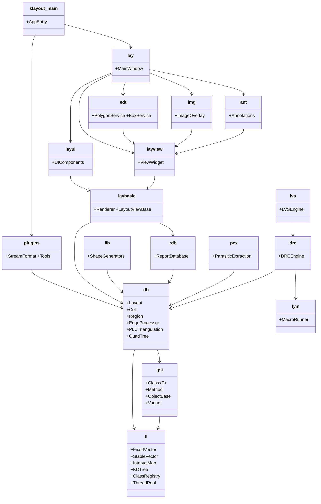

每一层只依赖下方的层，形成严格的**无环依赖图**。

### 1.3 核心设计原则

1. **最小依赖**：`tl` 不依赖任何其他模块，是整个系统的基石
2. **接口与实现分离**：Region 是外观（Facade），具体行为委派给 Delegate
3. **静态多态优先**：大量使用 C++ 模板实现策略选择（模板策略模式）
4. **脚本平等**：Python 和 Ruby 绑定通过 GSI 对称实现，无优先级差异
5. **插件热加载**：文件格式和工具可通过 `.so` 动态扩展

---

## 第 2 章 模板库层（tl）：系统的骨架

### 2.1 角色

`tl`（Template Library）是整个 KLayout 的基础。想象一栋大楼的地基——面向上层提供支撑，自己却不依赖任何其他部分。在 KLayout 的依赖图中，tl 是**唯一的源点**：所有模块都直接或间接依赖它，但它不依赖任何人。

> 为什么需要自己造一套基础库？因为 KLayout 需要特殊的容器（稳定迭代器、固定容量小向量）、特殊的算法（区间映射、kd-树）和特殊的注册机制（类自动注册）。STL 提供了通用方案，但在这些特定领域不够用。

### 2.2 模块划分

tl 约 80 个头文件，按功能分为以下类别：

#### 2.2.1 容器与数据结构

| 组件 | 一句话理解 | 为什么不用 STL |
|------|-----------|---------------|
| `tlFixedVector` | "定长小数组"——栈上分配，不碰堆内存 | STL vector 总是堆分配，对于频繁创建的小对象太慢 |
| `tlStableVector` | "地址不变数组"——插在中间，已有元素地址不动 | STL vector 插入会导致迭代器全部失效 |
| `tlReuseVector` | "回收站数组"——删除的元素位置留给新元素 | STL vector 删除后会缩容，浪费已分配空间 |
| `tlHeap` | 二叉堆——优先队列的底层实现 | 标准 `std::priority_queue` 接口不够灵活 |
| `tlIntervalMap` | "区间→值"词典——给定一个点，查出它属于哪个区间 | 扫描线的核心需求，标准库不提供 |
| `tlIntervalSet` | 区间集合——高效合并重叠区间 | 同上，专为扫描线算法设计 |
| `tlKDTree` | kd-树——高维空间"附近有什么"的快速查询 | libc++ 没有 kd-树，需要自定义 |

**设计要点**：KLayout 选择自定义容器而非 STL 的原因是**控制内存布局和迭代器稳定性**。例如 `tlStableVector` 保证插入元素不会使已有元素的指针/引用失效——这在复杂的图结构中至关重要。

> 用一个现实世界的比喻来理解这些容器：
> - **tlFixedVector** = 一个 4 座的轿车——车里最多坐 4 个人，座位固定，不需要去停车场取车（堆分配）。适合短途（短期使用）。
> - **tlStableVector** = 一列火车——新车厢加到尾部，前面车厢不动。已有乘客的地址不会变，即使新乘客上车。
> - **tlReuseVector** = 一个有"空位"标记的公交站——有人下车后，站台记住空位，新来的人直接坐过去，不用去新建一个站台。

**`tlIntervalMap`——区间映射的直观理解：**

区间映射解决的是"给定一个点，它落在哪个区间里"的问题。在版图工具的扫描线算法中，扫描线从左到右扫过版图，不断遇到"边开始"和"边结束"事件——区间映射在这里追踪当前哪些 x 区间被多边形覆盖。

```
在 X 轴上有这些区间：
  [10, 20) → "层 1 金属"     (编号: A)
  [15, 30) → "层 2 多晶硅"   (编号: B)
  [25, 40) → "层 3 接触孔"   (编号: C)

查询 X=12 → A              (只被金属覆盖)
查询 X=18 → A, B           (金属 + 多晶硅重叠)
查询 X=28 → B, C           (多晶硅 + 接触孔重叠)
查询 X=50 → ∅              (啥也没有)

tlIntervalMap 实现了这一查询在 O(log n + k) 时间内完成。
```

**`tlKDTree`——空间索引的直观理解：**

kd-树解决的是"给定一个矩形区域，里面有什么"的问题。想象一本中国地图册：
- 先分成南北两半（x 方向分割）
- 南边再分东西两半（y 方向分割）
- 东边再分南北两半（x 方向分割）
- ...

递归切分，直到每个区域很小。要找"北京市范围内所有 100 米以上的建筑"，不需要遍历全中国的数据——只需顺着树走到"北京"那个分支，在那个小区域里查就行了。

kd-树的 k 代表**维度数**（版图是 2D 的，所以 k=2；如果是版图 + 时间维度的分析，k=3）。

#### 2.2.2 算法

| 组件 | 用途 |
|------|------|
| `tlAlgorithm` | 通用算法（如 `tl::nth_element`——线性中位数选择） |
| `tlSelect` | 选择算法 |
| `tlKDTree` | kd-树上的范围搜索和最近邻搜索 |

#### 2.2.3 基础设施

| 组件 | 用途 |
|------|------|
| `tlString` | 字符串处理（split、join、格式化） |
| `tlStream` | 流抽象（文件、内存、压缩、HTTP） |
| `tlXMLParser/Writer` | XML 序列化 |
| `tlVariant` | 变体类型（任意值的动态容器） |
| `tlExpression` | 表达式求值引擎 |
| `tlThreadedWorkers` | 线程池 |
| `tlClassRegistry` | 泛型类注册机制 |
| `tlUnitTest` | 单元测试框架 |

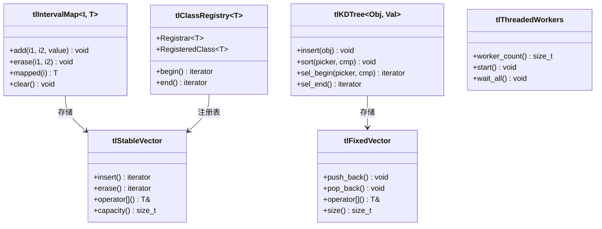

#### 2.2.4 注册机制（tlClassRegistry）

`tl::ClassRegistry` 是 KLayout **插件体系的核心**，它通过 `tl::Registrar<T>` 和 `tl::RegisteredClass<T>` 实现了自动注册机制：

```cpp
// 注册（在静态初始化阶段执行）
static tl::RegisteredClass<StreamFormatDeclaration> gds2_reg(
  new GDS2FormatDeclaration(), "GDS2", 100
);

// 遍历所有已注册的实例
for (auto i = tl::Registrar<StreamFormatDeclaration>::begin();
     i != tl::Registrar<StreamFormatDeclaration>::end(); ++i) {
  // 使用 i->second 访问每个 StreamFormatDeclaration
}
```

这实质上是**在静态初始化时自动构建的工厂注册表**，避免了显式的初始化代码。所有新格式/新插件只需声明一个静态变量即可自动加入系统。

### 2.3 复杂度分析

| 组件 | 操作 | 复杂度 |
|------|------|--------|
| `tlIntervalMap` | 插入 | O(m) 重叠区间数 |
| `tlIntervalMap` | 查询 | O(log n) |
| `tlKDTree` | 构造 | O(n log n) |
| `tlKDTree` | 范围查询 | O(√n + k) |
| `tlNthElement` | 中位数选择 | O(n) |

### 2.4 注释及评论

tl 层的设计体现了 EDA 软件的工程需求：对性能敏感的容器（`tlFixedVector`、`tlStableVector`）、对空间查询的算法（`tlKDTree`、`tlIntervalMap`）、和灵活的扩展机制（`tlClassRegistry`）。这些不是通用 C++ 标准库的替代品，而是对 STL 在特定领域不足的补充。

---

## 第 3 章 通用脚本接口（gsi）：C++ 与脚本的桥梁

### 3.1 问题

KLayout 需要用 Python 和 Ruby 两种脚本语言访问完整的 C++ API。为每个语言单独维护绑定意味着双倍的工作量和可能的语义差异。

> **现实中的类比**：想象你有一本中文说明书（C++ API），现在需要翻译成英文版和日文版。传统做法是请两个翻译各自翻一本——英文版少了一个功能，日文版可能还不知道。GSI 的思路是：**先把中文说明书转换成一种中立的"标注语言"（比如数学符号），再从这个标注语言生成英文和日文版本**。这样两个版本的内容一定一致，因为源是同一个。

### 3.2 解决方案：GSI 抽象层

GSI（Generic Scripting Interface）定义了一个**与语言无关的元描述系统**：

```
C++ 类  →  GSI 类声明  →  Python 绑定 或 Ruby 绑定
         （元数据）     （pya 实现）  （rba 实现）
```

**为什么不用 SWIG 或 pybind11？**

SWIG、pybind11、Boost.Python 这些工具也能生成绑定代码，但它们在 KLayout 的语境下有几个问题：

| 问题 | 说明 |
|------|------|
| **代码生成** | SWIG 需要预处理步骤，增加构建复杂度 |
| **继承支持** | KLayout 有复杂的 C++ 继承体系（如 Delegate 模式），工具生成的代码难以处理运行时的多态 |
| **插件动态注册** | 插件通过 `tlClassRegistry` 在运行时被发现，静态生成的绑定无法覆盖运行时载入的类 |
| **双语言一致性** | 两种语言的绑定来自同一个元描述，天然保证 API 一致 |

GSI 的元描述是**纯 C++ 静态变量**，在编译期完成注册，在运行时通过模板元编程进行类型推导和方法分发。这样避免了代码生成器，同时保持了灵活性。

#### 3.2.1 GSI 类声明

每个需要导出的 C++ 类都通过 `gsi::Class<T>` 模板声明其接口：

```cpp
// gsiDeclDbLayout.cc
static gsi::Class<db::Layout> decl("Layout",
  gsi::method("create_cell", &db::Layout::create_cell,
    gsi::arg("name")
  ) +
  gsi::method("top_cell", &db::Layout::top_cell) +
  gsi::method("cell_by_name", &db::Layout::cell_by_name,
    gsi::arg("name")
  ) +
  gsi::method("layer", &db::Layout::find_layer,
    gsi::arg("layer"), gsi::arg("datatype")
  ) +
  // ... 约 8 个静态变量对应六个主要头文件
);
```

这个声明包含：
- 类名（`"Layout"`）
- 方法列表（名称、函数指针、参数名）
- 属性、枚举等元信息

**一个方法的完整旅程（从 Python 到 C++）：**

```python
# Python 代码
layout = klayout.db.Layout()
cell = layout.create_cell("TOP")
```

背后发生的是这样的：

```
第 1 步：Python 的 layout.create_cell("TOP")
         │
第 2 步：pya_Object 拦截，发现方法名 "create_cell"
         │
第 3 步：在 GSI 注册表中查找类 "Layout" 的方法 "create_cell"
         │
第 4 步：GSI_Method::invoke({"TOP"}) 被调用
         │        ↑ 这里做了类型推断："TOP" 是 std::string 类型
第 5 步：实际调用 C++ 的 db::Layout::create_cell("TOP")
         │
第 6 步：C++ 返回一个 db::Cell 指针
         │
第 7 步：GSI 将返回值包装成 GSI_ObjectBase（增加引用计数）
         │
第 8 步：pya_Convert::cxx_to_py() 创建 Python 的 db.Cell 对象
         │
第 9 步：返回给 Python 用户
```

这个过程中，第 4 步最关键——`GSI_Method::invoke()` 内部做了**参数类型推断和重载解析**。例如 KLayout 中 `create_cell` 可能有多个重载版本：
- `create_cell(string name)` 
- `create_cell(string name, bool copy_global_props)`

GSI 根据传入参数的数量和类型，自动选择正确的重载。

#### 3.2.2 对象生命周期管理

GSI 定义了 `ObjectBase`，提供引用计数：

```cpp
class ObjectBase {
  void add_ref();    // 递增引用计数
  void unref();      // 递减引用计数，到零则销毁
  bool is_ref();
};
```

C++ 对象可被 Python 和 Ruby 共享管理，当脚本侧不再引用时自动析构。

#### 3.2.3 类型编组

`pyaMarshal.h` 和 `rbaMarshal.h` 负责 C++ ↔ 脚本语言的类型转换：

```
C++ int/double/bool  →  Python int/float/bool
C++ std::string      →  Python str / Ruby String
C++ db::Point        →  Python db.Point / Ruby RBA::Point
C++ 容器              →  脚本语言的可迭代对象
```

### 3.3 架构图示

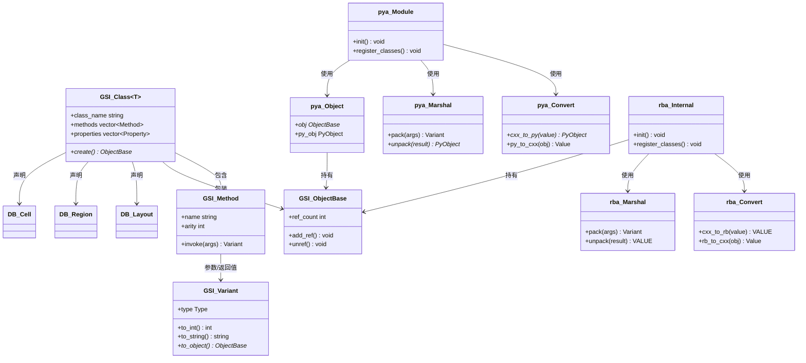

### 3.4 注释及评论

GSI 的设计借鉴了 Qt 的元对象系统（MOC）和 SWIG 的思路，但更轻量——不需要代码生成器或预处理器。所有的元信息通过**静态变量**在编译期注册，在运行时通过模板元编程解析。代价是每个核心类需要约 200-500 行的 GSI 声明代码（`gsiDeclDb*.cc` 有 50+ 文件）。

---

## 第 4 章 几何数据模型（db）：核心数据与操作

### 4.1 角色

`db` 是 KLayout 最大的库（约 447 个头文件），编译为 `libklayout_db`。它提供从基础几何类型到完整版图操作的全栈能力：

**按功能分类的模块清单：**

| 类别 | 文件数 | 代表文件 |
|------|--------|---------|
| 基础几何类型 | ~15 | `dbPoint`, `dbBox`, `dbEdge`, `dbPolygon`, `dbTrans` |
| 形状容器 | ~10 | `dbShape`, `dbShapes`, `dbShapes2`, `dbShapes3` |
| 空间索引 | ~5 | `dbQuadTree`, `dbBoxTree`, `dbBoxScanner` |
| 算法引擎 | ~15 | `dbEdgeProcessor`, `dbShapeProcessor`, `dbPLCTriangulation`, `dbPolygonTools` |
| 操作集合 | ~60 | `dbRegion`, `dbEdges`, `dbEdgePairs`, `dbTexts` + Delegate 各变体 |
| 布局细胞 | ~30 | `dbLayout`, `dbCell`, `dbInstances`, `dbRecursiveShapeIterator` |
| 层次化处理 | ~15 | `dbDeepShapeStore`, `dbHierProcessor`, `dbHierarchyBuilder` |
| 文件 I/O 流 | ~20 | `dbStream`, `dbReader`, `dbWriter`, `dbCommonReader` |
| 网表与 LVS | ~60 | `dbNetlist`, `dbNetlistCompare`, `dbLayoutToNetlist`, `dbNetlistCompare` |
| 技术/属性 | ~15 | `dbTechnology`, `dbPropertiesRepository`, `dbLayerProperties` |
| GSI 声明 | ~50 | `gsiDeclDb*.cc` 系列 |
| 测试 | ~70 | `db*.cc` (unit_tests/) |
| 其他 | ~80 | 工具、插件支持、初始化等 |

### 4.2 基础几何类型系统

#### 4.2.1 坐标体系（dbTypes.h）

KLayout 使用两种坐标系统：

| 类型 | 精度 | 适用场景 |
|------|------|----------|
| `db::Coord` / `db::Point` | 整数 (int) | 版图数据的标准表示 |
| `db::DCoord` / `db::DPoint` | 双精度浮点 (double) | 三角剖分、变换后计算 |

为什么需要两套？因为版图设计用的单位是 **纳米或微米的整数倍**（整数坐标高效、无舍入误差），但三角剖分等计算任务会产生非整数坐标（需要浮点精度）。

所有基础类型都有整型和双精度两种版本：

```
db::Point   ↔ db::DPoint
db::Box     ↔ db::DBox
db::Edge    ↔ db::DEdge
db::Vector  ↔ db::DVector
db::Polygon ↔ db::DPolygon
```

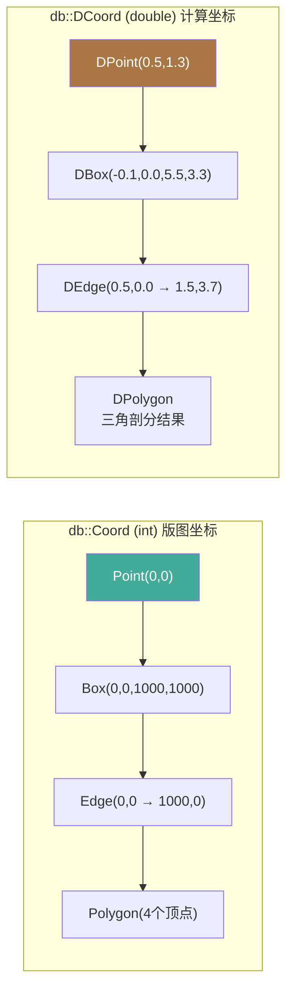

**版图坐标系的含义：**

```
    y ↑
      │     ┌──────────┐
  1000│     │          │
      │     │  Box     │
  500 │     │  (芯片区域)│
      │     │          │
    0 └─────┴──────────┴──→ x
      0    500   1000  1500

  Point(500, 500) = 芯片上 (500nm, 500nm) 的位置
  Box(0, 0, 1000, 1000) = 1μm × 1μm 的矩形区域
  Edge(500,0 → 500,1000) = 从底部到顶部的一条垂直线
```

#### 4.2.2 Point

`dbPoint.h` — 2D 点，支持基本向量运算：

```cpp
class Point {
  Coord x() const;              // X 坐标
  Coord y() const;              // Y 坐标
  Coord distance(const Point &) const;  // 欧氏距离
  double exact_distance(const Point &) const;  // 精确浮点距离
  // 运算符: +, -, ==, !=, < (字典序)
};
```

**点与点之间的关系：**

```
                              Point B(6,4)
                              ●
                             ╱
                            ╱ 距离 = √((6-2)²+(4-1)²) = 5
                           ╱
                    ●──────╴
               Point A(2,1)

    点的本质: 芯片上的一个位置 (x, y)
    版图中点的含义: 多边形的顶点、边的端点、通孔的中心位置
```

#### 4.2.3 Box

`dbBox.h` — 轴对齐包围盒，是空间索引和重叠检测的基石：

```cpp
class Box {
  Point p1() const;    // 左下 (min)
  Point p2() const;    // 右上 (max)

  Coord left() const;   Coord right() const;
  Coord bottom() const; Coord top() const;
  Coord width() const;  Coord height() const;
  Coord area() const;

  bool contains(const Box &) const;   // 完全包含
  bool overlaps(const Box &) const;   // 重叠
  bool touches(const Box &) const;    // 接触

  Box enlarged(Coord d) const;        // 均匀扩张
  Box enlarged(Coord dx, Coord dy) const;
  Box &move(const Point &);           // 平移
};
```

**设计要点**：Box 使用两个 Point（左下/右上）存储，左下坐标 ≤ 右上坐标。空 Box 表示为 p1 > p2 的特殊状态。

**Box 的可视化：**

```
      left   right
        │      │
 top ───┼──────┼──
        │      │
        │  ┌───┴────┐ p2(10,8)
        │  │        │
        │  │  BOX   │
        │  │        │
  p1(2,1)└──┴─── ───┘
        │         │
 bottom ─┼─────────┼──
        │         │
        width=8   │
                  height=7

  Box 通常表示:
  • 芯片上的一个矩形区域
  • 多边形的外接矩形（快速排除不需要的碰撞检测）
  • 视口区域（只渲染这个区域内的图形）
```

**Box 包含/重叠/接触的判定：**

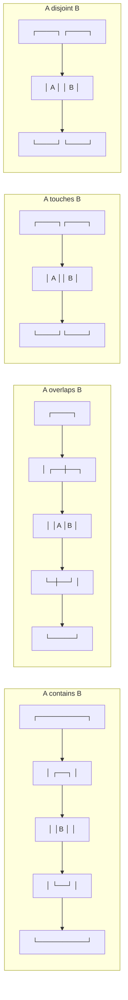

#### 4.2.4 Edge

`dbEdge.h` — **有向边**（从 p1 到 p2），是扫描线算法的基本处理单元：

```cpp
class Edge {
  Point p1() const;     // 起点
  Point p2() const;     // 终点

  Coord dx() const;     // p2.x - p1.x
  Coord dy() const;     // p2.y - p1.y
  double length() const;

  // 方向判定
  bool is_ortho() const;       // 轴对齐
  bool is_45_degree() const;   // 45 度
  bool is_vertical() const;    // 垂直 (dx == 0)
  bool is_horizontal() const;  // 水平 (dy == 0)

  // 交点计算 (扫描线核心)
  Point intersection_point(const Edge &) const;
  bool intersects(const Edge &) const;
  Coord intersection_y(Coord x) const;  // 给定 x 求 y

  // 几何关系
  bool parallel_to(const Edge &) const;
  double distance(const Point &) const;
  int side_of(const Point &) const;    // 点在边的哪一侧

  // 比较
  bool less_xy() const;   // 用于扫描线排序
};
```

**有向边的含义：**

```
       p1(2,6) ●
               ╲
                ╲ 有向边 Edge(p1→p2)
                 ╲     dx = 6, dy = -4
                  ╲    length = √(6²+4²) ≈ 7.2
                   ╲
                    ● p2(8,2)

  水平边:  Edge(0,0 → 10,0)   dy=0（扫描线算法中的"扫描线状态更新的触发器"）
  垂直边:  Edge(5,0 → 5,10)   dx=0（扫描线算法中的"多边形边界标记"）
  斜边:    Edge(0,0 → 3,1)    dx≠0, dy≠0（需要计算与水平扫描线的交点）

  版图设计中绝大多数边是水平或垂直的（曼哈顿几何），
  这是扫描线算法优化的重要前提。
```

**Edge 比较器的重要性：**

扫描线算法需要两种排序：
- **`edge_ymin_compare`**：`min(y1, y2)` 排序，决定边的**进入扫描线的时间**
- **`EdgeXAtYCompare2`**：对穿过某 y 扫描线的所有边，按**该 y 处的 x 坐标**排序

```
          y
          ↑
          │  扫描线从上到下移动
   y=10 ──┼────e2────────────   ← 三条边穿过 y=10
   y=9 ───┼────e2────e1─────
   y=8 ───┼────e2────e1────e3
   y=7 ───┼─────────e1────e3
   y=6 ───┼───────────────e3
          └────────────────────→ x
               x=3   x=6  x=9
          在每个 y 上，按 x 排序: e2(3) < e1(6) < e3(9)
```

**两条边的交点判断：**

```
          e1: (0,0)→(10,10)    e2: (10,0)→(0,10)
          
          (0,10)●             ●(10,10)
                ╲           ╱
                 ╲  交点   ╱
                  ╲ (5,5) ╱
                   ╲     ╱
                    ╲   ╱
                     ╲ ╱
          (0,0)●──────●──────●(10,0)
                    交集点

  EdgeProcessor 的 Phase 1 就是在做这个:
  找出所有这样的「边与边」交叉点
```

#### 4.2.5 Polygon

`dbPolygon.h` — 多边形（支持孔洞）：

```cpp
class Polygon {
  // 构造
  Polygon(const Box &);              // 从 Box 构造
  Polygon(const std::vector<Point> &);   // 从点序列
  Polygon(const std::vector<Point> &pts, const std::vector<Polygon> &holes);

  // 遍历
  polygon_edge_iterator begin_edge() const;  // 边遍历
  size_t vertices() const;                   // 顶点数
  const Point &vertex(size_t i) const;

  // 属性
  double area() const;
  bool is_clockwise() const;
  Box bbox() const;

  // 洞
  size_t holes() const;
  const Polygon &hole(size_t i) const;

  // 操作
  Polygon transformed(const Trans &) const;
};
```

**多边形在版图中的实物对应：**

```
  不带孔的多边形（一个完整的金属走线）：
  
  (10,30) ●──────● (40,30)       顶点序列: (10,30) → (40,30) → (40,10) → (10,10)
          │      │
          │  金属 │                四条边:
          │  走线 │                  Edge_0: (10,30) → (40,30)  上边
          │      │                  Edge_1: (40,30) → (40,10)  右边
  (10,10) ●──────● (40,10)          Edge_2: (40,10) → (10,10)  下边（方向向左）
                                    Edge_3: (10,10) → (10,30)  左边
  
  带孔的多边形（一个环形的金属框，中间有挖空）：
  
  (0,40) ●──────────● (50,40)
         │   ┌────┐  │
         │   │ 空 │  │           顶点: 外部 4 个 + 内部 4 个
         │   │ 洞 │  │           孔洞: 1 个（多边形环的内部挖空区域）
         │   └────┘  │
  (0,0)  ●──────────● (50,0)
  
  在芯片中，带孔的多边形常见于:
  • 环形的保护环 (guard ring)
  • 中间有通孔的焊盘
  • 挖空的隔离区域
```

**多边形、边、点之间的关系：**

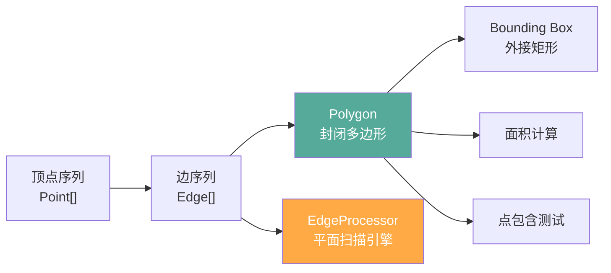

多边形以**点序列 + 孔洞列表**存储。不保证为简单多边形（SimplePolygon 保证不自交）。遍历使用 `polygon_edge_iterator` 逐边访问。

**SimplePolygon**：不自交的单环多边形。比 `Polygon` 更轻量。

#### 4.2.6 Trans（变换）

`dbTrans.h` — 版图变换，支持平移/旋转/镜像：

```
Trans(位移, 角度, 镜像)  → 应用于 Point/Box/Polygon/Edge

角度: R0, R90, R180, R270
镜像: 无, M90 (沿对角线镜像), M45 等
```

变换复合：`t1 * t2` 表示先 t2 后 t1。

#### 4.2.7 Shape（多态形状容器）

`dbShape.h` — 变体风格的形状容器，用 union+type_tag 表示：

```cpp
class Shape {
  bool is_box() const;      // 是 Box
  bool is_polygon() const;  // 是 Polygon
  bool is_edge() const;     // 是 Edge
  bool is_text() const;     // 是 Text
  bool is_path() const;     // 是 Path
  bool is_user_object() const;  // 是用户自定义对象

  Box box() const;
  Polygon polygon() const;
  Edge edge() const;
  Text text() const;
  // ...
};
```

`Shape` 是 KLayout 中的"万能形状"——它使用内部变体存储（类似 C++17 的 `std::variant` 但手写实现），避免了虚函数开销。

#### 4.2.8 Shapes（形状存储）

`dbShapes.h` — 带空间索引的形状容器，是 Cell 的底层存储：

```cpp
class Shapes {
  iterator insert(const Shape &);     // 插入形状
  void erase(iterator);               // 删除形状
  void clear();
  size_t count() const;

  // 空间查询 (通过内置 QuadTree)
  template <class Sel>
  void each(const Sel &) const;          // 遍历所有
  template <class Sel>
  void each_touching(const Box &, const Sel &) const;  // 接触查询
  template <class Sel>
  void each_overlapping(const Box &, const Sel &) const; // 重叠查询

  // 直接访问 QuadTree
  const QuadTree<...> &qt() const;
};
```

`Shapes` 内部用**连续向量**存储形状（内存局部性好），同时维护一个 `QuadTree` 做空间索引。插入时两者同步更新。

**Shapes 的双重存储结构：**

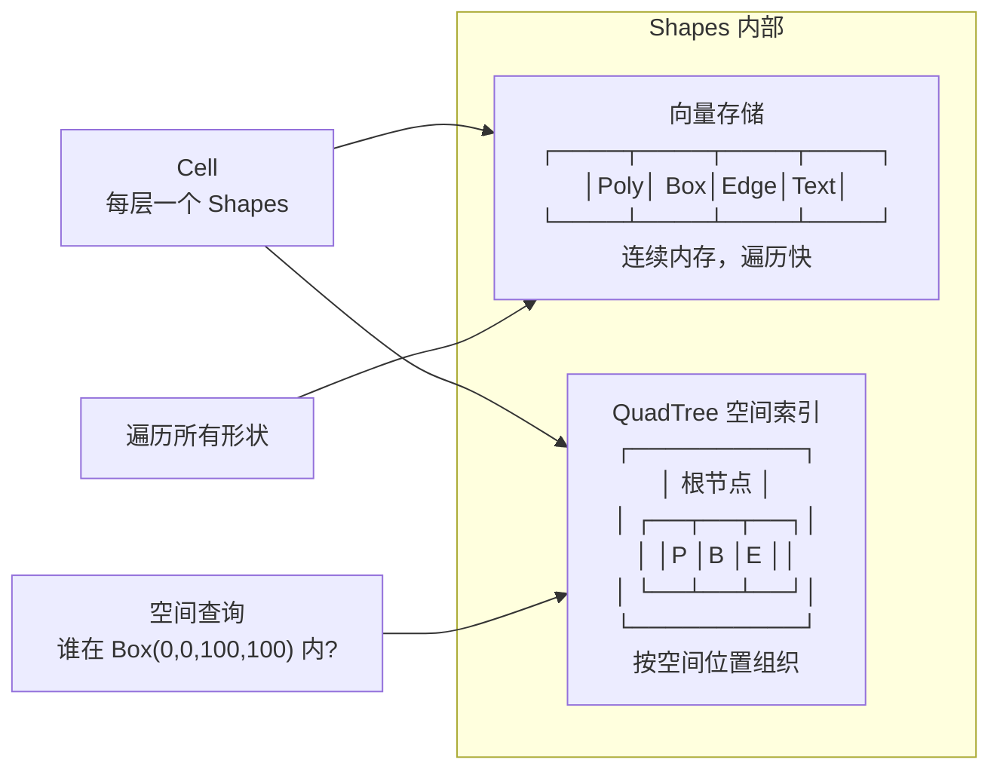

> **为什么需要两种存储方式？** 向量适合遍历（把芯片所有形状都过一遍），QuadTree 适合查询（只要某个区域内的形状）。两个需求在版图编辑中都有大量使用——平移视图时需要重建画面（遍历），而放大到特定区域后只需要那个区域的形状（空间查询）。

### 4.3 核心类关系

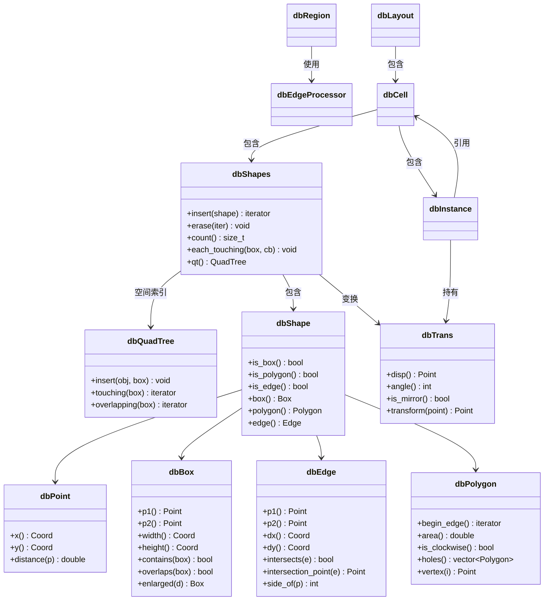

### 4.4 操作集合层

#### 4.4.1 Region（多边形操作集合）

`dbRegion.h` — 最常用的版图操作类，是多边形集合的**外观**：

```cpp
class Region {
  // ── 构造 ──
  Region();
  Region(const Polygon &);
  Region(const Box &);

  // ── 访问 ──
  bool empty() const;
  size_t count() const;
  Box bbox() const;

  // ── 布尔运算 ──
  Region boolean(const Region &other, BooleanOp::BoolOp mode) const;
  Region &operator&=(const Region &r);  // AND
  Region &operator|=(const Region &r);  // OR
  Region &operator-=(const Region &r);  // NOT
  Region &operator^=(const Region &r);  // XOR

  // ── 几何变换 ──
  Region sized(Coord d) const;           // 扩张/收缩
  Region sized(Coord dx, Coord dy) const; // 各向异性
  Region merged(bool min_merge = false) const;     // 合并相邻多边形
  Region smoothed(Coord d) const;        // 平滑
  Region rounded_corners(Coord r) const; // 圆角

  // ── 空间查询 ──
  bool inside(const Point &) const;      // 点包含
  Region selected_interacting(const Region &other) const;
  Region selected_not_interacting(const Region &other) const;

  // ── 层级管理 ──
  Region flattened(bool recursive = true) const;
  bool is_merged() const;
};
```

**Region 操作分类：**

| 类别 | 操作 | 底层引擎 |
|------|------|---------|
| 布尔 | AND, OR, NOT, XOR | `EdgeProcessor` |
| 形态 | sized (扩张/收缩) | `EdgeProcessor` + Minkowski 和 |
| 合并 | merged | `EdgeProcessor` (SimpleMerge) |
| 过滤 | selected_interacting, selected_not_interacting | `EdgeProcessor` (InteractionDetector) |
| 检查 | inside | `PolygonTools` (射线法) |
| 平滑 | smoothed, rounded_corners | `PolygonTools` |

**Region 的四种基本使用方式：**

```python
# Python 中 Region 的常用操作
region_a = Region(polygons_a)
region_b = Region(polygons_b)

# 1. 布尔合成
contact = region_a & region_b   # 金属与通孔重叠处

# 2. 几何变换
gate = polysilicon.sized(0.05)  # 多晶硅扩张 0.05μm

# 3. 合并
active_merged = active.merged() # 合并相邻有源区

# 4. 过滤
overlap = active.selected_interacting(gate)  # 与 Gate 有交互的有源区
```

#### 4.4.2 Edges（边操作集合）

`dbEdges.h` — 边的集合，支持 DRC 检查的核心类型：

```cpp
class Edges {
  // ── 构造 ──
  Edges();
  Edges(const Edge &);

  // ── 边操作 ──
  Edges merged() const;               // 合并重叠边
  Edges sized(Coord d) const;          // 边扩张/收缩

  // ── DRC 检查 ──
  EdgePairs width_check(Coord min_width, ...) const;    // 宽度检查
  EdgePairs space_check(Coord min_space, ...) const;     // 间距检查
  EdgePairs separation(const Edges &other, Coord d, ...) const;
  EdgePairs enclosing(const Edges &other, Coord d, ...) const;
  EdgePairs overlap(const Edges &other, Coord d, ...) const;
  EdgePairs inside(const Edges &other, Coord d, ...) const;

  // ── 转换 ──
  Region polygons(Coord min_width = 0) const;      // 边→多边形
  Region extended(Coord dx, Coord dy) const;       // 边→扩展区域
};
```

**DRC 检查调用链**（以 width_check 为例）：

```
Edges::width_check(0.1)
  → 调用 RegionCheckUtils::edge2edge_check()
    → 构建 Edge2EdgeCheckBase
      → 用 BoxScanner 扫描边对 → 筛选 WidthRelation
        → 输出 EdgePairs
```

#### 4.4.3 EdgePairs（边对集合）

`dbEdgePairs.h` — DRC 检查结果，存储违规边对：

```cpp
class EdgePairs {
  bool empty() const;
  size_t count() const;

  // 过滤
  EdgePairs filtered(const EdgeRelationFilter &) const;

  // 转换
  Region extended(Coord dx, Coord dy) const;  // 边对→标记区域
  Edges edges() const;

  // 输出
  void output(const std::string &name) const;  // 写入报告
};
```

#### 4.4.4 各集合的 Delegate 体系

| 集合 | 抽象基类 | 具体实现 |
|------|---------|---------|
| Region | `RegionDelegate` | FlatRegion, MutableRegion, DeepRegion, EmptyRegion, OriginalLayerRegion, AsIfFlatRegion |
| Edges | `EdgesDelegate` | 同上（对应变体） |
| EdgePairs | `EdgePairsDelegate` | 同上 |
| Texts | `TextsDelegate` | 同上 |

Delegate 核心接口（以 RegionDelegate 为例）：

```cpp
class RegionDelegate {
  // 子类必须实现的纯虚操作
  virtual Region *boolean(const Region *other, BooleanOp::BoolOp mode) const = 0;
  virtual Region *sized(Coord d) const = 0;
  virtual Region *merged() const = 0;
  virtual bool empty() const = 0;
  virtual Box bbox() const = 0;
  virtual RegionDelegate *clone() const = 0;
  // ...
};
```

**FlatRegion** — 多边形存储为平铺的 `Shapes`，所有操作直接计算并返回新的 FlatRegion。
**DeepRegion** — 边存储在 `DeepShapeStore` 中，操作通过 `HierProcessor` 保持层次。
**MutableRegion** — 类似 FlatRegion 但允许直接插入/删除多边形。
**EmptyRegion** — 所有操作返回空结果，用作优化。
**OriginalLayerRegion** — 持有 Layout+Layer 引用，操作时实时从版图读取。
**AsIfFlatRegion** — 包装一个 DeepRegion，但假装是平的（用于需要平铺语义的操作）。

### 4.5 EdgeProcessor 引擎详解（KLayout 最核心的 4123 行代码）

EdgeProcessor 是 KLayout 的心脏。几乎所有的几何操作——布尔运算、sizing（扩张/收缩）、merge（合并）、interaction（交互检测）——最终都通过它完成。它所在的 `dbEdgeProcessor.h/cc` 两个文件合计 4123 行代码，是 KLayout 单文件体量最大的算法引擎。

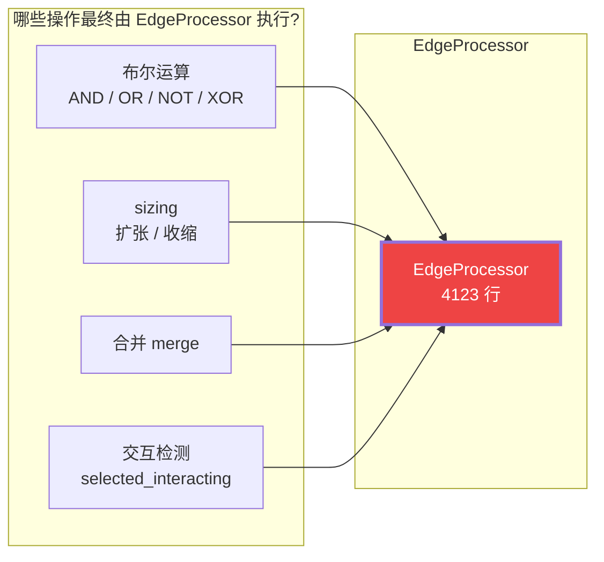

#### 4.5.1 一句话理解 EdgeProcessor

> **EdgeProcessor = 一个可以把多个多边形合并/相减/相交的"几何计算器"**

它的工作方式非常巧妙：不直接操作多边形，而是把所有多边形的**边**提取出来，用**扫描线算法**找到边与边的交叉点，在交叉点把边切开，再沿着切好的边走一遍，边走边用**缠绕计数**判断"这一小段边该不该输出"。

```
输入: 多个多边形 (A 和 B)
    ↓ 提取边、标记所属层
输入: 边序列 + property 标签
    ↓ Phase 1: 找交点
边序列 + 交叉点
    ↓ Phase 2: 在交叉点切开
无交叉的边段序列
    ↓ Phase 3: 沿扫描线走 → 缠绕组计数 → 判定输出
输出: 新的多边形 (A AND B, 或 A OR B, 或 ...)
```

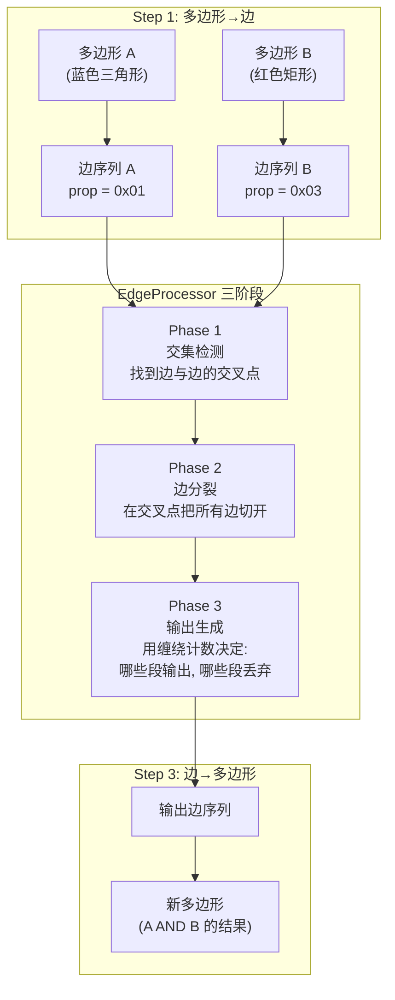

#### 4.5.2 输入与输出模型

EdgeProcessor 的输入是**带标签的边序列**，输出是**新的边序列**（然后由 ShapeProcessor 组装回多边形）。

```cpp
// EdgeProcessor 的核心接口（简化版）
class EdgeProcessor {
  // ── 输入 ──
  void insert(const Edge &edge, unsigned int property);
  // 插入一条边, property 的 bit0=0 表示层 A, bit0=1 表示层 B
  // property 的高比特位区分同一层内的不同多边形

  // ── 处理 ──
  void process(EdgeSink &sink, EdgeEvaluatorBase &evaluator);
  // 执行三阶段算法, 结果输出到 sink

  // ── 清空 ──
  void clear();
};
```

**输入边的标记规则：**

```
property 的二进制结构:
  bit 0:   0 = 层 A, 1 = 层 B
  bit 1+:  多边形编号（同一层内的不同多边形）

例子:
  层 A 的第一个多边形: property = 0b0001
  层 A 的第二个多边形: property = 0b0011
  层 B 的第一个多边形: property = 0b0010
  层 B 的第二个多边形: property = 0b0110
```

**为什么需要 property 标签？** 因为缠绕计数是按 property 跟踪的——每条边进入一个多边形时 +1，退出时 -1。我们需要知道每条边属于哪个多边形，才能正确计算每个位置上的"层叠计数"。

#### 4.5.3 内部数据结构

EdgeProcessor 内部维护三条关键的数据结构：

```
EdgeProcessor 内部:
  ┌──────────────────────────────────────────────────┐
  │  edges: WorkEdge 的向量                           │
  │    ┌──────────┐ ┌──────────┐ ┌──────────┐        │
  │    │ WorkEdge │ │ WorkEdge │ │ WorkEdge │ ...    │
  │    │  ①       │ │  ②       │ │  ③       │        │
  │    └──────────┘ └──────────┘ └──────────┘        │
  │                                                   │
  │  每个 WorkEdge 包含:                              │
  │    ┌─────────────────────────────┐                │
  │    │ edge:    Edge 数据 (p1→p2) │                │
  │    │ prop:    property 标签      │                │
  │    │ cuts:    CutPoints 向量     │← Phase 1 写入 │
  │    │ next_for_y: 指针链接        │← Phase 3 使用  │
  │    └─────────────────────────────┘                │
  └──────────────────────────────────────────────────┘
```

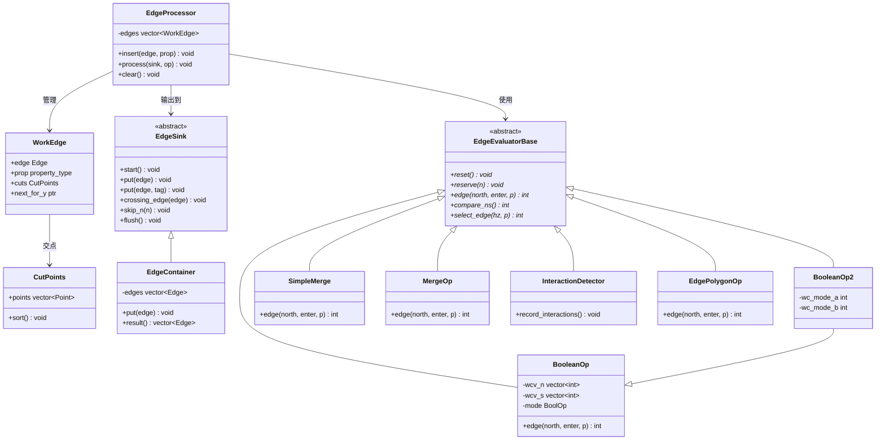

**`WorkEdge`** 是核心的工作单元——它包装了一条原始边，并在 Phase 1 后记录下这条边与哪些其他边相交（存储在 `cuts` 中）。`next_for_y` 是一个指针，用于在 Phase 3 中将穿过同一 y 扫描线的边快速链接起来。

**`CutPoints`** — 边上的交点列表：

```
 边 Edge(p1→p2):
 p1 ●─────────────────────────────● p2
        ↑     ↑     ↑     ↑
        c1    c2    c3    c4     ← 与其它边的交点

 CutPoints 中存储 {c1, c2, c3, c4}
 排序后: c1 < c2 < c3 < c4 (沿边方向)

 分裂后: [p1→c1], [c1→c2], [c2→c3], [c3→c4], [c4→p2]
```

**`EdgeSink`** — 输出接收器。这是一个抽象接口，不同的子类做不同的事：
- **`EdgeContainer`**：只把输出边收集起来
- **`PolygonSink`**：把输出边重新组装成多边形（由 ShapeProcessor 使用）
- **`RegionSink`**：直接把结果写入 Region

#### 4.5.4 评估器（EdgeEvaluatorBase）——不同操作的决策逻辑

评估器（Evaluator）是 EdgeProcessor 的"大脑"，决定了"哪些边段该输出"。不同的评估器实现不同的操作：

| 评估器 | 用途 | 一句话描述 |
|--------|------|-----------|
| `BooleanOp` | AND, OR, XOR, A-B, B-A | 看两层缠绕计数，按布尔逻辑组合 |
| `BooleanOp2` | 带缩放参数的布尔操作 | 同上，但支持参数化 inside 判断 |
| `SimpleMerge` | 合并相连多边形 | 只要非零缠绕就输出（把所有东西粘一起） |
| `MergeOp` | 指定重叠度合并 | 缠绕计数 ≥ 阈值才输出（只取同时覆盖 N 层的区域） |
| `InteractionDetector` | 检测谁跟谁挨着 | 不输出新形状，而是记录哪些多边形有交集 |
| `EdgePolygonOp` | 取边在多边形内/外/边界 | 按缠绕计数判定边相对于某多边形的方位 |

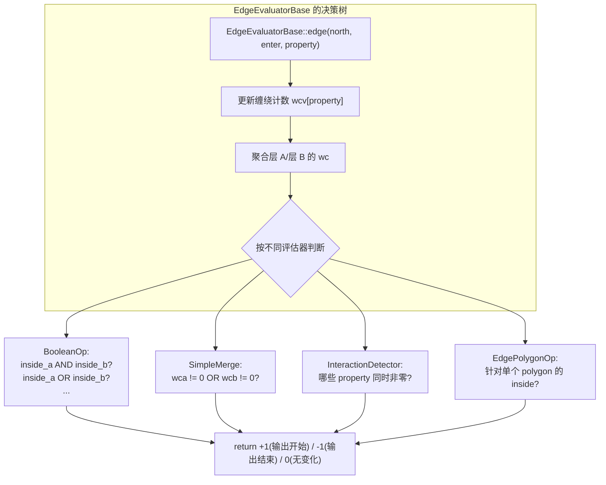

#### 4.5.5 三阶段算法逐段详解

##### Phase 1：交集检测——"找到所有边在哪里交叉"

这是最复杂的一个阶段。它的目标只有一个：**找出所有边与边的交点**。

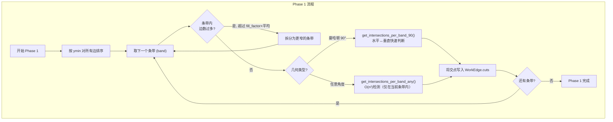

**为什么需要分条带（band）？**

```
如果不分条带: 检查所有 N 条边两两是否相交  →  O(n²)

分条带后:
  y_max ┌─────────────────────────────┐
        │ 条带 1 (Δy=1)  边数: k₁     │  k₁ << N
        ├─────────────────────────────┤
        │ 条带 2 (Δy=1)  边数: k₂     │  k₂ << N
        ├─────────────────────────────┤
        │ 条带 3 (Δy=1)  边数: k₃     │  k₃ << N
        ├─────────────────────────────┤
        │ ...                        │
  y_min └─────────────────────────────┘

  总复杂度: O(∑kᵢ²) << O(N²)
    
  因为边被切成条带后，一条长斜边会出现在多个条带中
  但每个条带内的边数远小于总数
```

**填充因子（fill factor）** 控制着条带细分到什么程度：

```
fill_factor = 1.5 (默认值)

判断逻辑:
  if 条带内的边数 > fill_factor × 条带宽度 × 平均边密度:
    条带内边太多了 → 拆分为更窄的条带

fill_factor > 1: 允许条带内有一定冗余，避免过度细分
fill_factor < 1: 更激进的细分，减少每条带内的计算量

1.5 是经验和实际测试的平衡值
```

**曼哈顿几何的优化为什么快？**

```
曼哈顿几何 = 所有边都是水平或垂直的

水平边: y = 常数, x 从 left 到 right
垂直边: x = 常数, y 从 bottom 到 top

两条曼哈顿边相交的条件:
  一条水平 (y_c) 和一条垂直 (x_c)
  且: 水平边的 x 范围包含 x_c
  且: 垂直边的 y 范围包含 y_c

判断曼哈顿边是否相交:
  O(1) 时间, 只需要比较坐标, 无需解方程

非曼哈顿边（任意角度）:
  需要判断两条线段是否相交
  需要解直线方程、检查参数是否在 [0,1] 内
  每条边需要解一次方程
```

**Phase 1 的输出：**

```
Phase 1 完成后, 每个 WorkEdge 的 cuts 字段包含了
它与其它所有边的交点：

  边 E1: p1 ●────●────●────● p2
              c1   c2    c3

  边 E2: p1 ●─●────● p2
              c4  c2

  c2 是 E1 和 E2 的交点（同时出现在两条边的 cuts 中）
  c1 是 E1 与另一条边的交点
  ...
```

##### Phase 2：边分裂——"像切蛋糕一样在交叉点切开每条边"

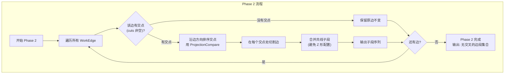

**为什么必须做边分裂？用一个例子说明：**

```
一条斜边穿过一个多边形边界：

      多边形 A 的内部
  ┌──────────────────────┐
  │                      │
  │    斜边 E1           │
  │    ●────────────────● │
  │                      │
  └──────────────────────┘

  E1 全部在多边形 A 内 → E1 可以作为输出
    
现在增加多边形 B:

  ┌──────────────────────┐
  │  ┌──────────┐        │
  │  │  多边 B  │        │
  │  │          │        │
  │  │     ●────┼────●   │
  │  │          │        │
  │  └──────────┘        │
  └──────────────────────┘

  E1 穿过 B 的边界:
    左段: 在多边形 A 内, 在多边形 B 内
    右段: 在多边形 A 内, 在多边形 B 外

  如果不分裂:
    E1 要么全部输出, 要么全部不输出 → 错误!

  在交点处切开:
    E1a: 左段 (在 B 内) → A NOT B 时丢弃
    E1b: 右段 (在 B 外) → A NOT B 时输出
```

**合并共线子段：**

```
边分裂后可能产生这样的情况：

  原始边: p1────────c1────────p2
  分裂后: [p1─c1] 和 [c1─p2]

  如果 c1 不是一个真正的转折点（共线）：
  p1 ════ c1 ════ p2
   ─────  和   ─────  →  合并为 ─────────

  合并后减少边的数量, 简化后续处理
  "Z 形配置"是指交替的边上/边下模式, 合并可避免误判
```

**Phase 2 的输出：**

```
Phase 2 完成后:
  所有边都在交点处被切开
  没有任何两条边在内部相交
  每条边要么完全在多边形内, 要么完全在多边形外

  因此 Phase 3 中, 对每条边段的判定是确定的, 不会出现"半条在内, 半条在外"的情况
```

##### Phase 3：输出生成——"沿扫描线边走边判断"

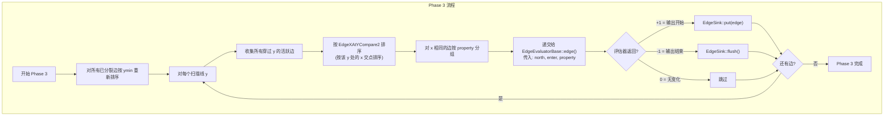

**Phase 3 的核心——评估器的 edge() 方法：**

每次扫描线遇到一组边时，评估器的 `edge(north, enter, property)` 被调用。它的三个参数含义：

```
参数:
  north:    true  = 边在扫描线上方方向朝下 (进入)
            false = 边在扫描线下方方向朝上 (退出)
  enter:    true  = 进入扫描线 (从上往下扫)
            false = 退出扫描线
  property: 该边的 property 标签

评估器内部:
  维护 wcv[] = 缠绕计数数组
  每次 edge(north, enter, p) 被调用时:
    if enter:
      wcv[property] += 1
    else:
      wcv[property] -= 1
    
  然后根据当前所有 wcv 值, 按操作模式判定"该不该输出"
```

**Phase 3 的扫描过程——用视觉理解：**

```
y 方向从 y_max 到 y_min 逐行扫描:

  y=10 ●──────●──────●──────● ← 活跃边: E1, E2, E3
        ↑      ↑      ↑
      E1(3)  E2(6)  E3(9)   ← 按 x 排序: x=3, x=6, x=9
    
      每组 (x 相同) 递交给 evaluator:
      x=3:  E1(north=true, enter=true, prop=1)
            → BooleanOp.edge(): wcv[1] 0→1, inside_a=true, enter → 输出开始
      
      x=6:  E2(north=false, enter=true, prop=2)
            → BooleanOp.edge(): wcv[2] 0→1, inside_b=true
    
      x=9:  E3(north=true, enter=true, prop=1)
            → BooleanOp.edge(): wcv[1] 1→2, still inside_a=true → 无变化

  下一行 y=9:
      E1 还在, E2 还在, E4 加入
      ...
```

**水平边的特殊处理：**

```
水平边 (dy=0) 不能像垂直边或斜边那样处理
因为水平边不会"穿过"扫描线——它平行于扫描线

处理方式:
  水平边不参与 Phase 1 和 Phase 3 的扫描
  水平边在 Phase 2 后通过 compare_ns() 单独处理
  
  compare_ns() 的作用:
    对同一 y 上的水平边, 按它们的 x 范围排序
    如果两条水平边在同一 y 上方向相反 (一条朝左, 一条朝右)
    它们之间的区域是"内部"还是"外部"?
    compare_ns 判定这个
```

#### 4.5.6 缠绕计数（Wrap Count）模型详解

缠绕计数是决定"一段边该不该保留"的核心机制。

**直观理解：**

> 想象你站在一个巨大迷宫的地面上。每当你跨过一条蓝色的线（进入一个蓝色多边形），你的计数器 +1。每当你跨过一条红色的线（退出一个蓝色多边形），你的计数器 -1。如果计数为 0，你站在形状外面；如果计数 > 0，你站在形状里面。

**在 KLayout 中，缠绕计数是按 property 跟踪的：**

```python
# 缠绕计数的完整逻辑
class BooleanOp:
    def __init__(self, mode):
        self.wcv = {}       # property → 缠绕计数
        self.was_inside = False  # 上一时刻是否在输出区域内
        self.mode = mode    # AND, OR, A_B, B_A, XOR

    def edge(self, north, enter, prop):
        # Step 1: 更新缠绕计数
        if enter:
            self.wcv[prop] = self.wcv.get(prop, 0) + 1
        else:
            self.wcv[prop] = self.wcv.get(prop, 0) - 1

        # Step 2: 按层聚合缠绕计数
        # bit0 = 0 → 层 A, bit0 = 1 → 层 B
        wca = sum(c for p, c in self.wcv.items() if (p & 1) == 0)
        wcb = sum(c for p, c in self.wcv.items() if (p & 1) == 1)

        # Step 3: 非零 = 在形状内
        inside_a = (wca != 0)
        inside_b = (wcb != 0)

        # Step 4: 按模式组合
        if self.mode == 'AND':
            inside = inside_a and inside_b
        elif self.mode == 'OR':
            inside = inside_a or inside_b
        elif self.mode == 'A_B':   # A NOT B
            inside = inside_a and not inside_b
        elif self.mode == 'B_A':   # B NOT A
            inside = not inside_a and inside_b
        elif self.mode == 'XOR':
            inside = (inside_a and not inside_b) or (not inside_a and inside_b)

        # Step 5: 状态变化时输出
        if inside != self.was_inside:
            self.was_inside = inside
            return +1 if inside else -1  # +1 = 输出开始, -1 = 输出结束
        
        return 0  # 无变化
```

**每种布尔模式下的缠绕计数组合：**

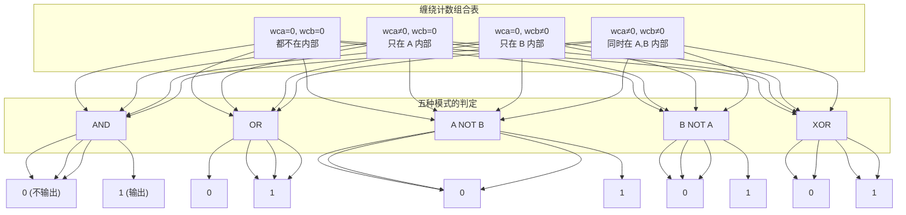

#### 4.5.7 完整示例：A AND B 的全过程

让我们用一个具体的例子，完整走一遍 EdgeProcessor 的三阶段。

**输入：两个矩形**

```
矩形 A: (0,0)~(10,5)    层 A
矩形 B: (3,2)~(7,8)    层 B

   y
   ↑
 8 ──┐        ┌────┐
   │ │        │ B  │
 5 ──┤ ┌──────┴┐   │
   │ │ │ 重叠  │   │
 2 ──┤ └──────┘   │
   │ │   A       │
   └─┴────────────┴──→ x
   0   3   7    10
```

**Step 0: 提取边并标记 property**

```
矩形 A 的 4 条边（逆时针）:
  E_A1: (0,0)→(10,0)  property=0x01 (层A, 多边形1)
  E_A2: (10,0)→(10,5) property=0x01
  E_A3: (10,5)→(0,5)  property=0x01
  E_A4: (0,5)→(0,0)   property=0x01

矩形 B 的 4 条边（逆时针）:
  E_B1: (3,2)→(7,2)   property=0x03 (层B, 多边形1)
  E_B2: (7,2)→(7,8)   property=0x03
  E_B3: (7,8)→(3,8)   property=0x03
  E_B4: (3,8)→(3,2)   property=0x03
```

**Step 1: Phase 1 — 找交点**

```
边和边之间检查是否相交:

E_A1 (0,0)→(10,0) 水平, y=0
  ↔ E_B1 (3,2)→(7,2) 水平, y=2  → 不相交 (y 不同)
  ↔ E_B2 (7,2)→(7,8) 垂直, x=7  → 不相交 (y=0 < 2)
  ↔ E_B3 (7,8)→(3,8) 水平, y=8  → 不相交
  ↔ E_B4 (3,8)→(3,2) 垂直, x=3  → 不相交

E_A2 (10,0)→(10,5) 垂直, x=10
  ↔ E_B2 (7,2)→(7,8) 垂直, x=7 → 不相交 (平行)
  ↔ E_B4 (3,8)→(3,2) 垂直, x=3 → 不相交 (平行)

E_A3 (10,5)→(0,5) 水平, y=5
  ↔ E_B2 (7,2)→(7,8) 垂直, x=7  → 相交于 (7,5)!  (x=7 在 [0,10], y=5 在 [2,8])
  ↔ E_B4 (3,8)→(3,2) 垂直, x=3  → 相交于 (3,5)!  (x=3 在 [0,10], y=5 在 [2,8])

E_A4 (0,5)→(0,0) 垂直, x=0
  ↔ ...都不相交

E_B1 (3,2)→(7,2) 水平, y=2
  ↔ E_A2 (10,0)→(10,5) 垂直, x=10 → 不相交
  ↔ E_A4 (0,5)→(0,0) 垂直, x=0   → 不相交

E_B3 (7,8)→(3,8) 水平, y=8
  ↔ E_A2 (10,0)→(10,5) 垂直, x=10 → 不相交 (y=8 > 5)
  ↔ E_A4 (0,5)→(0,0) 垂直, x=0   → 不相交

找到 2 个交点: 
  I1 = (7,5)  — E_A3 与 E_B2 的交点
  I2 = (3,5)  — E_A3 与 E_B4 的交点
```

**Step 2: Phase 2 — 边分裂**

```
在 2 个交点处切开受影响的边：

E_A3 (10,5)→(0,5) 原本是一条边
  在 I1=(7,5) 和 I2=(3,5) 处切开:
  注意: 沿边的方向排序交点: (3,5) 先于 (7,5)
  分裂为: [10→7], [7→3], [3→0]
  
  E_A3a: (10,5)→(7,5)  prop=0x01
  E_A3b: (7,5)→(3,5)   prop=0x01  
  E_A3c: (3,5)→(0,5)   prop=0x01

E_B2 (7,2)→(7,8) 在 I1=(7,5) 处切开:
  分裂为: [7→5], [5→2] (沿边的方向: (7,2)→(7,5)→(7,8))
  但边的方向是从 (7,2) 到 (7,8), 所以交点 (7,5) 在中间
  
  E_B2a: (7,2)→(7,5)  prop=0x03
  E_B2b: (7,5)→(7,8)  prop=0x03

E_B4 (3,8)→(3,2) 在 I2=(3,5) 处切开:
  分裂为: [3→5], [5→2] (沿边的方向: (3,8)→(3,5)→(3,2))
  
  E_B4a: (3,8)→(3,5)  prop=0x03
  E_B4b: (3,5)→(3,2)  prop=0x03

所有边的 cuts 清空。现在没有任何两条边内部相交。
```

**Step 3: Phase 3 — 输出生成（以 A AND B 为例）**

```
现在每条边都已被切断，扫描线从 y=8 往下扫到 y=0:

y=8:
  活跃边: E_B4a (3,8)→(3,5) 从 y=8 开始, E_B3 (7,8)→(3,8) 水平
  水平边 E_B3 由 compare_ns 单独处理
  E_B4a: north=true, enter=true, prop=0x03
    → wcv[0x03] = 1, wcb=1, wca=0
    → A AND B: inside_a=false → 不输出

y=7.5:
  活跃边: E_B4a (继续), E_B2b (7,5)→(7,8) 从 y=7.5 开始
  按 x 排序: E_B4a(x=3), E_B2b(x=7)
  E_B4a: north=true, enter=false, wcv[0x03] 不变
  E_B2b: north=false, enter=true, wcv[0x03] = 2
    → wca=0, wcb≠0 → 不输出

y=5 (关键行!):
  进入事件很多:
  E_A3a: (10,5)→(7,5)  enter=true, north=false → wcv[0x01] = 1
  E_B4a: (3,8)→(3,5)   enter=false (边结束), north=false
    → wcv[0x03] 1→0, wcb=0
  E_B2b: (7,5)→(7,8)   enter=false, north=true
    → wcv[0x03] 2→1
  
  此时 wca=1, wcb=1 → AND 输出!
  输出开始: E_A3a 的末端到 E_A3b 的起始 = (7,5)→(3,5)
  
  wait — EdgeProcessor 输出的是边段, 不是直接画多边形
  
  实际的过程更细致:
  在 y=5 处, 边的顺序是 E_B4a(x=3), E_A3b(x=3→7...), E_B2b(x=7)
  在 x=3 处: E_B4a 结束 (退出 B) + E_A3b 开始 (进入扫描线)
    评估器: wcv[0x03] 1→0 (退出 B), wcv[0x01] 保持 1
    → wca=1, wcb=0 → 输出开始!
```

**实际输出比这更复杂，我们直接看结果：**

```
A AND B 操作的结果应该是两个矩形的重叠部分:
  矩形 corners: (3,2), (7,2), (7,5), (3,5)

EdgeProcessor 输出的边序列:
  EdgeOut_1: (3,2)→(7,2)   (来自 E_B1 的部分)
  EdgeOut_2: (7,2)→(7,5)   (来自 E_B2a 的部分)
  EdgeOut_3: (7,5)→(3,5)   (来自 E_A3b 的部分, 方向反转)
  EdgeOut_4: (3,5)→(3,2)   (来自 E_B4b 的部分)

这些边由 ShapeProcessor 中的 PolygonSink 重新组装为多边形:

  (3,2)───(7,2)
     │      │
     │ AND  │
     │      │
  (3,5)───(7,5)

输出! 就是两个矩形的交集。
```

#### 4.5.8 EdgeProcessor 的性能特点

EdgeProcessor 的性能与输入边的**复杂度**和**分布**有关：

| 场景 | 复杂度 | 说明 |
|------|--------|------|
| 两个简单矩形 AND | O(1) | 边少, 曼哈顿几何, 几乎瞬间 |
| 两个复杂多边形布尔操作 | O(n log n + k) | n=边数, k=交点数 |
| 全芯片 merge | O(N log N) | N=全芯片边数, 受限于条带细分 |
| 大量非曼哈顿几何 | O(n²) 最坏 | 任意角度边的检测没有曼哈顿优化 |

**影响性能的关键因素：**

1. **曼哈顿比例** — 版图中 90° 边的比例越高, 性能越好。芯片版图通常 > 95% 曼哈顿
2. **边密度** — 平均每条带内的边数, 直接影响 Phase 1 的局部 O(n²) 检测
3. **交点密度** — 交点数越多, Phase 2 的边分裂越多, Phase 3 的处理量越大
4. **fill factor** — 控制条带细分的参数, 影响 Phase 1 的时间与空间权衡

**优化技巧：**

```
// 大批量布尔运算时, 合并输入再一次性处理比多次调用更快
// 坏的做法:
for each polygon in list:
    result = result & polygon  // 每次创建一个新的 EdgeProcessor

// 好的做法:
ep = EdgeProcessor()
for each polygon in list:
    insert polygon.edges into ep  // 全部插入后再统一处理
ep.process(sink, BooleanOp(AND))
```

### 4.6 ShapeProcessor — 边处理器到形状的桥接

`dbShapeProcessor.h/cc` — 将高级操作（Region 布尔/sizing）转换为 EdgeProcessor 调用链：

```
ShapeProcessor::boolean(region_a, region_b, mode):
  1. 遍历 region_a 的所有多边形 → 边序列 (property = 1)
  2. 遍历 region_b 的所有多边形 → 边序列 (property = 2)
  3. 将边插入 EdgeProcessor
  4. 设置 BooleanOp(mode)
  5. 设置 PolygonSink 作为输出接收器
  6. 调用 EdgeProcessor::process(sink, op)
  7. PolygonSink 将输出的边重新组装为多边形
  8. 返回 Region(多边形)
```

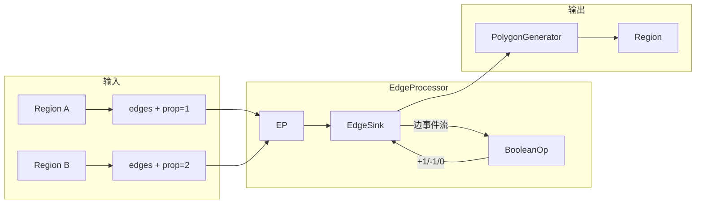

### 4.7 RegionProcessors — 区域专用操作

`dbRegionProcessors.h/cc` — Region 的专用处理器（不经过 EdgeProcessor 的场景）：

| 处理器 | 功能 |
|--------|------|
| `CornerDetector` | 检测多边形的角（凸/凹） |
| `PolygonToEdgeProcessor` | 多边形→边集合 |
| `RegionSizingProcessor` | Region 级 sizing（优化批量处理） |
| `RegionMergingProcessor` | Region 级合并 |

**CornerDetector 示例**：检测多边形的所有顶点类型：

```cpp
// 输出: 每个 corner 标记为 convex/concave/straight
enum CornerType { Convex, Concave, Straight };

CornerDetector::detect(const Polygon &poly):
  遍历每条边:
    叉积 = cross(edge_in, edge_out)
    if 叉积 > 0: 凸角
    if 叉积 < 0: 凹角 (for CW 多边形)
    if 叉积 = 0: 平角
```

### 4.8 EdgeBoolean — Edge 级布尔运算

`dbEdgeBoolean.h` — 边集合的布尔操作（使用 `tlIntervalMap`）：

```cpp
// EdgeOr, EdgeAnd, EdgeNot, EdgeXor 等
// 对两个边集合在扫描线上做布尔组合
// 用于 Edges 类上的布尔操作（如 Edges::merged）
```

实现机制：将边投影到 x 轴上的区间，用 `tlIntervalMap` 做区间合并操作。

### 4.9 空间索引体系

KLayout 有三种不同的空间索引，适用于不同场景。理解它们的区别是理解整个 db 模块性能的关键。

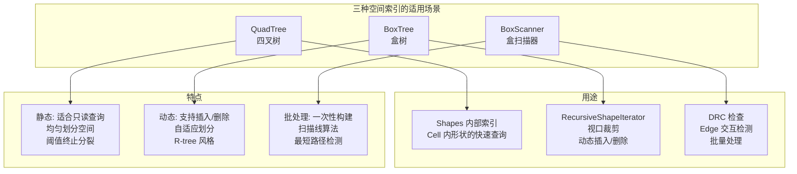

#### 4.9.1 QuadTree（四叉树） — "把版图切成四等份"

`dbQuadTree.h` — 点区域四叉树（PR-Quadtree），就像一个递归分割的棋盘：

```
完整区域 (0,0) — (100,100)
┌──────────────────────────────┐
│         │                    │
│  NW     │      NE            │
│         │                    │
│─────────┼────────────────────│
│         │                    │
│  SW     │      SE            │
│         │                    │
│   ┌───  │    ┌───────┐       │
│   │ P   │    │       │       │
│   └───  │    │  Q    │       │
│         │    │       │       │
└──────────────────────────────┘

NW 节点内含多于 thr=10 个形状
  → 继续分裂为 4 个子象限
  ┌──────────┬──────────┐
  │ NW-NW   │ NW-NE    │
  ├──────────┼──────────┤
  │ NW-SW   │ NW-SE    │
  │     ┌──┐│          │
  │     │P ││          │
  │     └──┘│          │
  └─────────┴──────────┘

    直到每个叶子节点的形状数 ≤ thr
```

```cpp
template <class T, class BC, size_t thr, class CMP>
class quad_tree_node { /* ... */ };

// 默认阈值: thr = 10
// BC: BoxConvert (对象到 Box 的转换器)
// CMP: 相等比较器
```

**在 Shapes 中的使用**：每个 `Shapes` 对象内含一个 QuadTree，插入形状时自动建立索引，空间查询时通过 `each_touching`/`each_overlapping` 利用 QuadTree 剪枝。

> **四叉树的直观理解**：想象你有一张世界地图，你要找"北京"这个城市。你不会从地图的左上角开始逐行扫描——你会先看亚洲在哪（东北象限），再看中国在哪（亚洲的东南），再看华北（中国的北部），最后找到北京。四叉树做的就是这件事——每次排除掉 3/4 的区域。

#### 4.9.2 BoxTree（盒树） — "把形状按包围盒层层分组"

`dbBoxTree.h` — 泛型盒树空间索引（R-tree 风格）：

```cpp
template <class BoxConvert>
class box_tree {
  void insert(const object_type &obj);
  void remove(const object_type &obj);

  template <class Receiver>
  void find_touching(const box_type &box, Receiver &recv) const;

  template <class Receiver>
  void find_overlapping(const box_type &box, Receiver &recv) const;
};
```

**BoxTree 的分组方式：**

```
  所有形状的包围盒：
  
  ┌──┐  ┌────┐  ┌──┐         ┌──┐
  │A │  │ B  │  │C │         │D │
  └──┘  └────┘  └──┘         └──┘
  
  按距离分组（R-tree 的自适应策略）:
  
  组 1 (A, B, C)            组 2 (D, E, F)
  包围盒: ┌──────────┐      包围盒: ┌──────┐
          │ ┌──┐┌──┐│              │┌──┐  │
          │ │A ││C ││              ││D │  │
          │ └──┘└──┘│              │└──┘  │
          │  ┌────┐ │              │┌────┐│
          │  │ B  │ │              ││ E  ││
          │  └────┘ │              │└────┘│
          └─────────┘              │┌──┐  │
                                  ││F │  │
                                  │└──┘  │
                                  └──────┘
  
  → 查询时只需检查与查询区域重叠的分组
  → 不像 QuadTree 那样固定分割，而是自适应
```

用于 `dbGenericShapeIterator` 和 `dbRecursiveShapeIterator` 中的视口裁剪。

> **BoxTree 与 QuadTree 的区别**：QuadTree 是"先切空间，再放东西"（空间驱动），BoxTree 是"先看东西在哪，再切空间"（数据驱动）。QuadTree 适合**静态数据**（切好了就不动了），BoxTree 适合**动态数据**（频繁插入/删除后仍保持效率）。

#### 4.9.3 BoxScanner（盒扫描器） — "把东西排好队，两两检查"

`dbBoxScanner.h` — **扫描线式交互检测引擎**，驱动 DRC 检查：

```cpp
template <class Obj, class Prop>
class box_scanner {
  void insert(const Obj *obj, Prop prop);
  void process(box_scanner_receiver<Obj, Prop> &recv);
};

template <class Obj1, class Prop1, class Obj2, class Prop2>
class box_scanner2 {
  // 双类型版本：只检测 Obj1 ↔ Obj2 交互
};
```

**BoxScanner 的工作原理：**

```
输入: 一组边/矩形
         │
         ▼
按 x 排序所有对象的左边界和右边界:
         │
         ▼
用一个"活跃集合"跟踪当前 x 位置上的所有对象:
         │
         ▼
  x=0  ──┼── [A 开始] ────────────────
  x=2  ──┼── [B 开始] ────────────────
  x=5  ──┼── [A 结束, B 继续] ────────
         │      ↑ 此时 A 和 B 同时"活跃" → 检测 A↔B 交互
  x=8  ──┼── [C 开始] ────────────────
         │      ↑ 此时 B 和 C 同时"活跃" → 检测 B↔C 交互
  x=10 ──┼── [B 结束] ────────────────
  x=12 ──┼── [C 结束] ────────────────

活跃集合中的对象两两交互，但不检测不在同一 x 段的对象
→ 避免了 O(n²) 的全量比较

BoxScanner 通过 y 方向扫描线 + x 方向活跃集来实现"两段剪枝"：
  1. y 方向: 条带扫描，按 y 分段
  2. x 方向: 活跃集，只比较当前 x 段内的对象
  → 只有两个维度上都重叠的对象才被检测
```

**三种索引的对比总结：**

| 特性 | QuadTree | BoxTree | BoxScanner |
|------|----------|---------|------------|
| **数据** | 静态 | 动态 | 批处理 |
| **原理** | 均匀四叉分割 | R-tree 分组 | 扫描线 + 活跃集 |
| **插入** | 重建 | O(log n) | O(n log n) |
| **查询** | O(log n) | O(log n) | O(n log n + k) |
| **修改** | 不支持 | 支持 | 不支持 |
| **用途** | Shapes 内部 | 视口裁剪 | DRC 检查 |
| **类比** | 世界地图 | 快递员按片区 | 流水线质检 |

### 4.10 版图层次结构引擎

#### 4.10.1 RecursiveShapeIterator

`dbRecursiveShapeIterator.h` — 层次化形状遍历器，从顶层 cell 递归进入所有子 cell：

```cpp
class RecursiveShapeIterator {
  // 构造
  RecursiveShapeIterator(const Layout &layout, const Cell &cell,
                         unsigned layer, const Box &region = Box::world());

  // 遍历
  bool at_end() const;
  void next();
  const Shape &shape() const;       // 当前形状
  const ICplxTrans &trans() const;  // 当前累积变换
  const CellInst &instance() const; // 当前实例

  // 层次信息
  unsigned depth() const;           // 当前深度
  const Cell *top_cell() const;     // 顶层 cell
};
```

**内部实现**：维护一个实例栈。深度优先遍历。进入子 cell 时将变换压栈，退出时弹栈。

#### 4.10.2 Layout / Cell / Instance

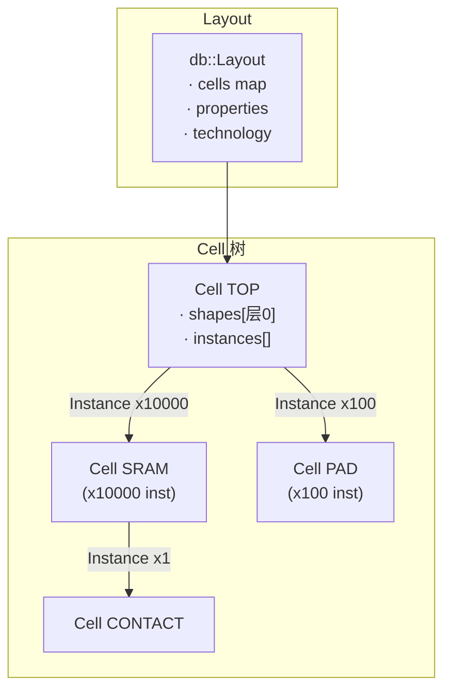

**Layout/Cell/Instance 的关系：**

```
Layout (一个 GDS 文件的全部内容)
  │
  ├── cells: 地图（cell名 → Cell 对象）
  │     Cell "TOP": 顶层细胞，包含形状和实例引用
  │     Cell "SRAM": 一个 6T SRAM 存储单元
  │     Cell "CONTACT": 接触孔单元
  │     Cell "PAD": 焊盘单元
  │
  ├── layers: 层索引（(层号,数据类型) → 内部编号）
  │     层 (1, 0) → 索引 0: 金属 1
  │     层 (2, 0) → 索引 1: 多晶硅
  │     层 (3, 0) → 索引 2: 接触孔
  │
  └── properties: 全局属性
```

**版图的"实例化"结构——为什么高效：**

```
假设设计了一个芯片：
  Cell TOP
    ├── Instance SRAM@(0,0)      ← SRAM 被引用了 4 次
    ├── Instance SRAM@(10,0)      但 SRAM 的数据只存一份
    ├── Instance SRAM@(0,10)
    ├── Instance SRAM@(10,10)
    ├── Instance PAD@(20,5)
    └── Instance PAD@(5,20)

  内存中实际存储：
  Cell TOP: shapes[] + 6 个 Instance（每个 Instance 存 cell 指针 + 变换）
  Cell SRAM: shapes[] (只存一份！)
  Cell PAD: shapes[] (只存一份！)
  Cell CONTACT: shapes[] (只存一份！)

  展开后 = 4 份 SRAM + 2 份 PAD 的全部 shapes
  展开前 = 1 份 SRAM + 1 份 PAD 的全部 shapes

  对于重复 10000 次的 SRAM cell，存储节省 ~10000 倍
```

**Layout 关键方法**：

```cpp
class Layout {
  Cell &cell(const std::string &name);
  Cell &create_cell(const std::string &name);
  void delete_cell(Cell &cell);
  Cell *top_cell();           // 返回顶层 cell

  unsigned int layer(unsigned int layer, unsigned int datatype);
  unsigned int get_layers() const;

  // 迭代
  template <class Iter>
  void each_cell(Iter iter) const;
};
```

**Cell 关键方法**：

```cpp
class Cell {
  const std::string &name() const;
  const std::pair<bool, bool> is_top() const;
  Box bbox() const;

  Shapes &shapes(unsigned int layer);
  const Shapes &shapes(unsigned int layer) const;

  // 实例管理
  void insert(const CellInst &inst);
  size_t instances() const;
  template <class Iter> void each_instance(Iter) const;

  // 层次信息
  size_t hierarchy_depth() const;
};
```

#### 4.10.3 DeepShapeStore

`dbDeepShapeStore.h` — 层次化布尔运算的结果存储器：

```cpp
class DeepShapeStore {
  // 内部维护影子 cell 层次
  // 每个 cell 在每个层的操作结果
  // 通过引用计数共享未修改的 cell

  // 与 HierProcessor 配合使用
  friend class HierProcessor;
};
```

**工作原理——用图片表示：**

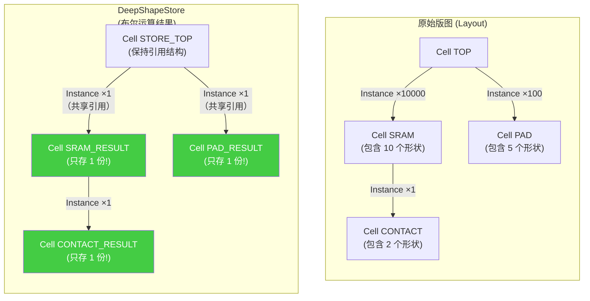

关键点：**即使原始版图中有 10000 个 SRAM 实例，DeepShapeStore 只存储和计算一次 SRAM_RESULT**。每个实例的变换（平移/旋转）只在顶层 Cell 的 Instance 中记录。

> **类比：** 就像你做 PowerPoint——你在第 1 页画了一个好看的流程图，然后在第 10 页、第 20 页、第 50 页都"复制粘贴"了它。PowerPoint 不会真的把流程图复制 4 份，而是只存一份、记 4 个引用位置。DeepShapeStore 做的就是同样的事。

#### 4.10.4 HierProcessor

`dbHierProcessor.h` — 层次化处理器，自底向上执行操作：

**HierProcessor 的处理顺序——一个具体的例子：**

```mermaid
flowchart TB
    subgraph "Cell 层次结构"
        TOP["TOP<br/>形状: 2 个矩形<br/>实例: SRAM×4, PAD×2"]
        SRAM["SRAM<br/>形状: 10 个矩形<br/>实例: CONTACT×1"]
        PAD["PAD<br/>形状: 5 个矩形<br/>实例: 无"]
        CT["CONTACT<br/>形状: 2 个矩形<br/>实例: 无"]

        TOP --> SRAM
        TOP --> PAD
        SRAM --> CT
    end

    subgraph "处理顺序 (自底向上)"
        S1["步骤 1: 处理 CONTACT<br/>没有子实例, 就地计算"]
        S2["步骤 2: 处理 SRAM<br/>先取子结果 CONTACT_RESULT<br/>再算本层 10 个矩形<br/>合并后缓存"]
        S3["步骤 3: 处理 PAD<br/>没有子实例, 就地计算<br/>缓存结果"]
        S4["步骤 4: 处理 TOP<br/>先取子结果 SRAM_RESULT<br/>再取子结果 PAD_RESULT<br/>算本层 2 个矩形<br/>全部合并 + 变换"]
    end

    CT --> S1
    SRAM --> S2
    PAD --> S3
    S1 --> S2
    TOP --> S4
    S2 --> S4
    S3 --> S4
```

```cpp
class HierProcessor {
  Result process(Cell *cell, const Operation &op) {
    // 缓存命中则直接返回（关键优化！）
    if (cache_.has(cell, op)) return cache_.get(cell, op);

    // 自底向上: 先处理所有子 cell 的实例
    for (auto inst : cell->instances()) {
      Result sub = process(inst.cell(), op);
      // 对子结果应用 Instance 变换（平移/旋转等）
      apply_transformation(sub, inst.trans());
      // 合并到本层综合结果
      combined = merge(combined, sub);
    }

    // 处理本层形状
    Result local = op.execute(cell->shapes(layer));

    // 本地结果 + 子结果 = 综合结果
    Result final = merge(local, combined);
    cache_.put(cell, op, final);
    return final;
  }

private:
  std::map<CacheKey, Result> cache_;  // 缓存: (cell, op) → Result
};
```

### 4.11 db 模块中的其他关键工具

#### 4.11.1 PolygonTools

`dbPolygonTools.h/cc` — 多边形级几何工具：

```cpp
// 点包含测试 (射线法)
bool inside_poly_test(const Point &pt, const Polygon &poly);

// 多边形切割
std::vector<Polygon> cut_polygon(const Polygon &poly, const Edge &line);

// 轮廓平滑
Polygon smooth_contour(const Polygon &poly, Coord max_dist);

// 半径提取
double extract_rad_from_contour(const Polygon &poly);

// 多边形合并 (简易)
Polygon merge_polygons(const Polygon &a, const Polygon &b);
```

**射线法点包含**：

```
inside_poly_test(pt, poly):
  count = 0
  for each edge of poly:
    if edge 水平穿过 pt 的右侧水平射线:
      count++
  return count % 2 == 1  (奇数为内部)
```

#### 4.11.2 Clip

`dbClip.h/cc` — 剪裁操作：

```cpp
// 按区域剪裁 cell 内容
Layout clip_layout(const Layout &layout, const Cell &cell,
                   const Box &region);

// 按多边形剪裁
Region clip_region(const Region &region, const Box &clip_box);
```

#### 4.11.3 TilingProcessor

`dbTilingProcessor.h/cc` — 将大版图分块处理（用于内存受限场景）：

```cpp
class TilingProcessor {
  // 设置分块大小
  void set_tile_size(Coord w, Coord h);

  // 注册回调
  template <class Func>
  void on_tile(Func f);

  // 执行分块处理
  void process(Layout &layout, const Cell &cell);
};
```

#### 4.11.4 EdgeNeighborhood / PolygonNeighborhood

`dbEdgeNeighborhood.h` / `dbPolygonNeighborhood.h` — 邻域分析：

```cpp
// 在给定距离内查找相邻边
class EdgeNeighborhood {
  void search(const Edges &source, Coord dist,
              EdgeNeighborhoodVisitor &visitor);
};

// 在给定距离内查找相邻多边形
class PolygonNeighborhood {
  void search(const Region &source, Coord dist,
              PolygonNeighborhoodVisitor &visitor);
};
```

使用 `BoxScanner` 检测邻域内的交互对象。

#### 4.11.5 FillTool

`dbFillTool.h/cc` — 填充图案生成（密度均匀化）：

```cpp
class FillTool {
  void set_fill_shape(const Polygon &shape);
  void set_tile_size(Coord w, Coord h);
  void set_min_overlap(Coord d);

  // 在排除区域内填充
  Region fill(const Region &exclude, const Box &boundary);
};
```

#### 4.11.6 CellHullGenerator

`dbCellHullGenerator.h/cc` — 生成 cell 的轮廓（hull）：

```cpp
// 生成 cell 内所有形状的最小包络多边形
Polygon generate_hull(const Cell &cell, unsigned layer);
```

### 4.12 db 模块依赖关系总图

```mermaid
flowchart TD
    TYPES["dbTypes.h\n坐标类型定义"]
    GEOM["基础几何\nPoint, Box, Edge,\nPolygon, Trans"]
    SHAPE["dbShape\n形状容器"]
    SHAPES["dbShapes\n带索引的存储\n(内含 QuadTree)"]
    QT["dbQuadTree\n空间索引"]
    EP["dbEdgeProcessor\n平面扫描引擎"]
    SP["dbShapeProcessor\n形状↔边桥接"]
    REGION["dbRegion\n多边形操作"]
    EDGES["dbEdges\n边操作"]
    EPR["dbEdgePairs\n边对操作"]
    TEXTS["dbTexts\n文本操作"]
    POLYTOOLS["dbPolygonTools\nsizing/inside"]
    LAYOUT["dbLayout\n版图容器"]
    CELL["dbCell"]
    RSI["dbRecursiveShapeIterator\n层次遍历"]
    DSS["dbDeepShapeStore\n深层形状存储"]
    HP["dbHierProcessor\n层次处理器"]
    BOXT["dbBoxTree\n盒树索引"]
    BSCAN["dbBoxScanner\n扫描线盒检测"]
    RCU["dbRegionCheckUtils\nDRC 检查工具"]
    EPRFILT["dbEdgePairRelations\n边对关系/过滤"]
    PLC["dbPLC\n分段线性框架"]
    PLCT["dbPLCTriangulation\nCDT三角剖分"]
    CLIP["dbClip\n裁剪"]
    TILE["dbTilingProcessor\n分块"]
    FILL["dbFillTool\n填充"]
    STRM["dbStream\n流格式框架"]
    NET["dbNetlist\n网表引擎"]
    GSI["gsiDecl*.cc\n脚本绑定声明"]

    TYPES --> GEOM
    GEOM --> SHAPE
    GEOM --> QT
    SHAPE --> SHAPES
    SHAPES --> QT
    SHAPES --> BOXT
    GEOM --> EP
    GEOM --> POLYTOOLS
    EP --> SP
    SP --> REGION
    SP --> EDGES
    SP --> EPR
    EP --> BSCAN
    BSCAN --> RCU
    BSCAN --> POLYTOOLS
    RCU --> EPRFILT
    REGION --> POLYTOOLS
    EDGES --> POLYTOOLS
    LAYOUT --> CELL
    CELL --> SHAPES
    CELL --> RSI
    RSI --> BOXT
    RSI --> REGION
    CELL --> DSS
    DSS --> HP
    HP --> REGION
    HP --> EDGES
    PLC --> PLCT
    GEOM --> PLC
    PLCT --> REGION
    LAYOUT --> STRM
    LAYOUT --> NET
    REGION --> GSI
    LAYOUT --> GSI
    CELL --> GSI
```

### 4.13 注释及评论

db 模块是 KLayout 中最大也最重要的模块。其设计哲学是：

1. **一切几何操作最终归一到 EdgeProcessor** — Region 的布尔、sizing、merge、interaction 等最终都会走平面扫描引擎。这种"统一引擎"减少代码重复，但要求引擎必须极致优化（曼哈顿快速路径、自适应条带）。

2. **委派模式实现多态** — 平铺/层次/空/只读四种 Region 实现通过 Delegate 模式统一接口。用户不需要知道底层是 FlatRegion 还是 DeepRegion。

3. **模板策略模式** — 大量使用 C++ 模板（QuadTree、BoxTree、local_operation）实现编译期多态，避免虚函数开销。

4. **空间索引冗余但必要** — QuadTree（均匀划分）、BoxTree（自适应划分）、BoxScanner（扫描线）三种空间索引并存，各自适配不同场景（静态存储、动态查询、批量交互检测）。

---

## 第 5 章 委派模式：区域/边/边对的多态体系

### 5.1 问题

在多边形集合（Region）上执行布尔操作，其结果可能是：
- **平铺的（Flat）**：所有多边形合并到一个平面中
- **层次化的（Deep）**：保留原始层次信息，以 Cell 引用的形式存储
- **空的（Empty）**：不包含任何多边形
- **原始层的（OriginalLayer）**：直接从版图层读取，只读

不同的实现有不同的行为——但它们需要共用同一套接口。

> **现实世界的类比**：假设你在经营一家快递公司，客户要寄包裹。包裹怎么运输取决于：
> - **平铺（FlatRegion）**：叫一辆卡车，把所有包裹堆在一起运过去
> - **层次化（DeepRegion）**：先按片区（Cell）分好，每个片区派一辆小货车，最后汇总
> - **空（EmptyRegion）**：没有包裹，什么都不做
> - **原始层（OriginalLayerRegion）**：直接从仓库架子（Layout）上取货
>
> 客户打电话说"我有 10 个包裹要寄"——他不会说"请用平铺运输"，他只说"寄包裹"。你选择哪种运输方式是他的事。**Delegate 模式做的事就是这个——用户统一说"求布尔 AND"，系统自动选择最优实现**。

### 5.2 委派模式（Delegate Pattern）

KLayout 使用 **State 模式**（委派模式）解决这个问题：

```mermaid
classDiagram
    class Region {
        -delegate RegionDelegate*
        +boolean(other, mode) Region
        +sized(d) Region
        +merged() Region
        +inside(point) bool
        +empty() bool
        +count() size_t
        +bbox() Box
    }
    class RegionDelegate {
        <<abstract>>
        +boolean(other, mode) Region*
        +sized(d) Region*
        +merged() Region*
        +inside(point) bool*
        +empty() bool*
        +clone() RegionDelegate*
    }
    class FlatRegion {
        -shapes Shapes
        +boolean(other, mode) Region*
        +sized(d) Region*
    }
    class MutableRegion {
        -shapes Shapes
        +insert(polygon) void
        +clear() void
        +boolean(other, mode) Region*
    }
    class DeepRegion {
        -store DeepShapeStore
        +boolean(other, mode) Region*
        +sized(d) Region*
    }
    class EmptyRegion {
        +boolean(other, mode) Region*
        +empty() bool*
    }
    class OriginalLayerRegion {
        -layout Layout*
        -layer unsigned
        +boolean(other, mode) Region*
    }
    class AsIfFlatRegion {
        -delegate DeepRegion*
        +boolean(other, mode) Region*
    }

    Region --> RegionDelegate : 委派
    RegionDelegate <|-- FlatRegion
    RegionDelegate <|-- MutableRegion
    RegionDelegate <|-- DeepRegion
    RegionDelegate <|-- EmptyRegion
    RegionDelegate <|-- OriginalLayerRegion
    RegionDelegate <|-- AsIfFlatRegion
    AsIfFlatRegion --> DeepRegion : 包装
```

#### 5.2.1 接口统一

Region 提供完整的操作接口，但这些接口只是**转发**给内部的 `delegate_`：

```cpp
// dbRegion.h
class Region {
  RegionDelegate *delegate_;  // 实际工作者

  Region boolean(const Region &other, BooleanOp::BoolOp mode) const {
    return delegate_->boolean(other, mode);
  }

  Region sized(Coord d) const {
    return delegate_->sized(d);
  }

  bool empty() const {
    return delegate_->empty();
  }
};
```

#### 5.2.2 具体实现

**FlatRegion**：将多边形存储在一个平铺的 `Shapes` 容器中，对所有操作就地执行，返回新的 `FlatRegion`。

**DeepRegion**：将多边形以**层次化方式**存储在 `DeepShapeStore` 中。布尔操作不会展开层次，而是在层次上执行，保持 Cell 引用的结构。其背后的引擎是 `HierProcessor`。

**OriginalLayerRegion**：不存储任何多边形，而是持有一个指向 `Layout` 和 `Layer` 的引用，操作时直接从版图读取数据。

#### 5.2.3 运算结果的类型推导

布尔运算的结果类型取决于操作数的类型：

```
FlatRegion  +  FlatRegion     →  FlatRegion
FlatRegion  +  DeepRegion     →  FlatRegion    (Deep 被展开)
DeepRegion  +  DeepRegion     →  DeepRegion    (保持层次)
DeepRegion  +  OriginalLayer  →  DeepRegion    (Original 被展开)
```

这种"类型提升"规则保证用户不需要关心底层的具体实现。

### 5.3 同样的模式：Edges、EdgePairs、Texts

Region 的委派模式被完全复制到 `Edges`、`EdgePairs` 和 `Texts` 上：

| 集合类型 | 基类 | 具体实现 |
|----------|------|----------|
| `Region` | `RegionDelegate` | Flat/Mutable/Deep/Empty/OriginalLayer/AsIfFlat |
| `Edges` | `EdgesDelegate` | 同上（对应边集合） |
| `EdgePairs` | `EdgePairsDelegate` | 同上（对应边对集合） |
| `Texts` | `TextsDelegate` | 同上（对应文本集合） |

### 5.4 注释及评论

委派模式是 KLayout 接口设计的核心。它使得用户可以**用同一套接口处理平铺和层次化数据**，而无需关心内部实现。这本质上是《设计模式》中 State 模式的应用——Region 在不同状态下（平铺/层次/空/只读）表现出不同行为，但对用户透明。

这种设计对"层次化布尔运算"（第 6 章）至关重要——DeepRegion 和 DeepEdges 是支撑 KLayout 在大规模版图上高效运行的关键。

---

## 第 6 章 层次化处理：应对大规模版图

### 6.1 问题

一个实际的芯片版图可能包含：
- 数百个 Cell 层次（如 CPU 的 SRAM 单元重复万次）
- 数亿到数十亿个形状
- 文件大小可达数十 GB

如果将所有形状"平铺"后处理，内存和计算时间都不可接受。

> **现实世界的类比：** 想象你要打印一栋摩天大楼的设计图。如果"平铺"处理，就是把大楼拆成每一块砖、每一根钢筋、每一块玻璃——然后全部列在一张巨大的纸上打印出来。这张纸可能比一个足球场还大。
>
> 相反，**层次化处理**的做法是：先画出"窗户"的图纸（一个 Cell），再画出"墙壁"的图纸（包含窗户的引用），再画出"楼层"的图纸（包含墙壁的引用），最后画出"大楼"的图纸（每层楼引用一份"楼层"图纸并注明"放在 10 米高"）。
>
> 这就像设计《我的世界》里的建筑——你只需要建好一种"砖块"，然后在整个建筑里重复摆放。实际存储的只有"一种砖块"的一份数据，每个摆放点只存一个坐标。

### 6.2 层次化数据结构

```mermaid
classDiagram
    class Layout {
        -cells map~string, Cell*~
        -top_cell Cell*
        +cell(name) Cell*
        +create_cell(name) Cell*
        +delete_cell(cell) void
        +top_cell() Cell*
    }
    class Cell {
        -name string
        -shapes_per_layer Shapes[]
        -instances Instance[]
        +shapes(layer) Shapes&
        +instances() Instance[]&
        +name() string
        +is_top() bool
    }
    class Instance {
        -cell Cell*
        -trans ICplxTrans
        +cell() Cell*
        +trans() ICplxTrans
        +bbox() Box
    }
    class Shapes {
        -objects vector~Shape~
        -quadtree QuadTree
        +insert(shape) iterator
        +erase(iter) void
        +count() size_t
    }
    class ICplxTrans {
        -disp Point
        -angle int
        -mirror bool
        +transform(point) Point
        +inverted() ICplxTrans
    }
    class RecursiveShapeIterator {
        -stack Instance[]
        -current_cell Cell*
        -current_shape iterator
        +at_end() bool
        +shape() Shape
        +trans() ICplxTrans
        +next() void
    }
    class DeepShapeStore {
        -shadow_cells Cell[]
        -results map~CacheKey, Result~
        +get(cell, op) Result
        +put(cell, op, result) void
    }

    Layout --> Cell : 包含
    Cell --> Shapes : 包含
    Cell --> Instance : 包含
    Instance --> Cell : 引用
    Instance --> ICplxTrans : 持有
    RecursiveShapeIterator --> Cell : 遍历
    RecursiveShapeIterator --> Instance : 栈
    DeepShapeStore --> Cell : 影子层次
```

KLayout 的 `db::Layout` 使用**树形 cell 结构**：

```
Layout (顶层容器)
  │
  ├── Cell "TOP" (顶层 cell)
  │     ├── Shape (多边形/边/文本)
  │     ├── Instance → Cell "SRAM" (x10000)
  │     │                    ├── Shape
  │     │                    └── Instance → Cell "CONTACT"
  │     └── Instance → Cell "PAD" (x100)
  │                          └── Shape
  │
  ├── Cell "SRAM" (子 cell)
  ├── Cell "CONTACT" (子 cell)
  └── Cell "PAD" (子 cell)
```

每个 `Instance` 是一个 Cell 的引用，带有变换（平移、旋转、镜像）。

### 6.3 层次化迭代器

`RecursiveShapeIterator` 在不展开层次的前提下，以类似"平铺"的顺序遍历所有形状：

```cpp
// 遍历 TOP cell 中所有形状（递归进入所有子 cell）
RecursiveShapeIterator iter(layout, layout.top_cell(), layer_idx);
while (!iter.at_end()) {
  const Shape &shape = iter.shape();
  const ICplxTrans &trans = iter.trans();  // 累积变换
  // 处理带有 trans 的形状
  ++iter;
}
```

该迭代器内部使用**深度优先遍历**，维护一个实例栈，在进入/退出子 cell 时压栈/弹栈。

### 6.4 层次化布尔运算——无需展开也能做布尔

> 关键问题：如果你有 Cell A（包含 2 个矩形）和 Cell B（包含 3 个圆形），Cell A 被引用了 10000 次。现在要对层 1 做布尔 AND——你真的需要把 10000 个 A 全部展开成 20000 个矩形吗？
>
> **不需要。** 层次化布尔运算的思想是：每个 Cell 只算一次，然后把结果缓存起来，在需要的地方通过变换（平移/旋转）复用。

`DeepRegion` 中的布尔操作不展开 Cell 层次。其背后的 `HierProcessor` 使用**自底向上**的策略：

```mermaid
flowchart TD
    A["HierProcessor::process(cell, op)"] --> B{"cache 命中?"}
    B -->|是| C["返回缓存结果"]
    B -->|否| D{"cell 有子实例?"}
    
    D -->|否| E["叶子 cell<br/>就地执行布尔运算"]
    E --> F["存入缓存"]
    F --> G["返回结果"]
    
    D -->|是| H["遍历所有子 cell 实例"]
    H --> I["对每个子 cell:<br/>递归 process(child, op)"]
    I --> J["应用 Instance 变换<br/>到子结果"]
    J --> K["合并所有子结果"]
    K --> L["处理本层 shapes"]
    L --> M["本地结果 + 子结果 = 综合结果"]
    M --> N["存入缓存"]
    N --> G
    
    style C fill:#bbf
    style F fill:#bbf
    style N fill:#bbf
```

```cpp
// 自底向上的层次化处理
Result HierProcessor::process(Cell *cell, const Operation &op) {
  if (cache_.has(cell, op)) {
    return cache_.get(cell, op);  // 命中缓存
  }

  // 先处理所有子 cell
  for (auto &inst : cell->instances()) {
    Result sub = process(inst.cell(), op);
    // 将子结果变换后合并
  }

  // 再处理本层形状
  Result local = op.execute(cell->shapes(layer));

  Result combined = local + sub_results;
  cache_.put(cell, op, combined);
  return combined;
}
```

#### 6.4.1 DeepShapeStore

`DeepShapeStore` 是层次化形状的存储后端，它：

- 维护一个"影子" cell 层次（与原始版图结构平行但不同）
- 存储每个 cell 在各层的操作结果
- 通过引用计数共享未修改的 cell

```
原始版图                     DeepShapeStore
TOP                          STORE_TOP
  SRAM (x10000)       →        SRAM_RESULT (共享，只存一份)
    CONTACT                      CONTACT_RESULT
  PAD                           PAD_RESULT
```

因为 SRAM 被实例化了 10000 次但其内容相同，`DeepShapeStore` 只需存储一份 SRAM_RESULT。

### 6.5 性能对比

| 场景 | 平铺处理 | 层次化处理 | 加速比 |
|------|----------|-----------|--------|
| SRAM 阵列 (10000 次重复) | 10000× 处理 | 1× 处理 + 缓存 | ~10000× |
| 全芯片 DRC | 数小时 ~ 天 | 数分钟 ~ 小时 | 10~100× |
| 增量编辑（修改一个 cell） | 全量重算 | 只重算被改 cell | 取决于改动范围 |

### 6.6 注释及评论

层次化处理是 KLayout 能在消费级硬件上处理大规模芯片版图的关键。核心思想是**缓存和重用**——相同的子 cell 只需要计算一次，通过引用变换（Instance + Transform）重复使用。

这与计算几何中的"平面扫描"算法形成互补：平面扫描解决的是单层的几何问题，而层次化处理解决的是多层的结构问题。两者结合起来才能处理真实的芯片版图。

---

## 第 7 章 应用引擎：DRC 与 LVS

### 7.1 架构总览

DRC 模块是一个**薄 C++ 壳 + 厚 Ruby 脚本**的混合架构：

```
src/drc/
  ├── drc/
  │   ├── drc.pro                    — 构建配置
  │   ├── drcForceLink.cc            — 强制链接
  │   ├── drcInit.cc                 — 模块初始化
  │   ├── drcResources.qrc           — 资源文件
  │   ├── drcResourcesInit.cc        — 资源初始化
  │   ├── drc_ruby.rb.template       — Ruby 模板
  │   └── built-in-macros/           — 8 个内置 Ruby DRC 脚本
  │       ├── _drc_engine.rb         — DRCEngine 主类
  │       ├── _drc_layer.rb          — DRCLayer 层操作
  │       ├── _drc_complex_ops.rb    — DRCOpNode 表达式体系
  │       ├── _drc_cop_integration.rb — DRC 检查函数生成
  │       ├── _drc_source.rb         — DRCSource 输入源
  │       ├── _drc_tags.rb           — 值包装类
  │       └── ... (其他辅助)
  ├── unit_tests/                    — DRC 测试
  └── lym/ (通过 klayout_lym 库加载 Ruby 脚本)
```

**关键设计：drc 模块本身几乎没有 C++ 代码**。所有 DRC 逻辑通过两种方式实现：
1. Ruby 脚本（内置宏）定义 DSL 语法和操作链组合
2. C++ 引擎位于 `db` 和 `rdb` 模块中（BoxScanner、RegionCheckUtils、ReportDatabase）

### 7.2 双层架构原理

```
┌─────────────────────────────────────┐
│  用户 DRC 脚本 (.drc 文件)          │
│  metal1.width(0.1).output("msg")   │
└──────────────────┬──────────────────┘
                   │ 加载
┌──────────────────▼──────────────────┐
│  Ruby 层 (内置宏)                    │
│  ┌──────────────────────────────┐   │
│  │ DRCEngine                    │   │
│  │  - source() 加载版图         │   │
│  │  - input()  读取层           │   │
│  ├──────────────────────────────┤   │
│  │ DRCLayer                     │   │
│  │  - width()  宽度检查         │   │
│  │  - space()  间距检查         │   │
│  │  - & | ^    布尔运算         │   │
│  ├──────────────────────────────┤   │
│  │ DRCOpNode (通用 DRC 表达式)  │   │
│  │  - width < 0.1.um            │   │
│  │  - (metal1 & metal2).space() │   │
│  └──────────┬───────────────────┘   │
└─────────────┼───────────────────────┘
              │ GSI 绑定调用
┌─────────────▼───────────────────────┐
│  C++ 执行层                         │
│  ┌──────────────────────────────┐   │
│  │ db::AsIfFlatRegion           │   │
│  │  - width_check()             │   │
│  │  - space_check()             │   │
│  ├──────────────────────────────┤   │
│  │ db::BoxScanner               │   │
│  │  - 扫描线矩形交互检测        │   │
│  ├──────────────────────────────┤   │
│  │ db::EdgeRelationFilter       │   │
│  │  - WidthRelation              │   │
│  │  - SpaceRelation              │   │
│  ├──────────────────────────────┤   │
│  │ rdb::ReportDatabase          │   │
│  │  - 违规存储                  │   │
│  └──────────────────────────────┘   │
└─────────────────────────────────────┘
```

### 7.3 Ruby DSL 详解

#### 7.3.1 两套 DRC 语法

KLayout 支持两套 DRC 语法：

**传统语法（DRCLayer）：**
```ruby
# 直接定义检查
metal1.width(0.1).output("width violations")
metal1.space(0.12).output("space violations")
contact = metal1 & via
contact.output("contacts")
```

**通用表达式语法（DRCOpNode）：**
```ruby
# 使用 drc() 方法和表达式节点
metal1.drc(width < 0.1.um).output("width")
metal2.drc(space > 0.12.um).output("space")

# 复合表达式
(metal1 & metal2).drc(width < 0.1.um).output("composite")
```

两者最终都映射到同一套 C++ 检查引擎。

#### 7.3.2 DRCEngine 类

`_drc_engine.rb` — DRC 运行的顶层控制器：

```ruby
class DRCEngine
  def initialize
    @layers = {}       # 层引用
    @sources = []      # 输入源
    @outputs = []      # 输出通道
  end

  def source(path)     # 指定输入版图
    s = DRCSource.new(path)
    @sources << s
    s
  end

  def input(layer, datatype)
    # 读取层数据 → 返回 DRCLayer
  end

  def output(name)     # 注册输出通道
    OutputChannel.new(self, name)
  end
end
```

#### 7.3.3 DRCLayer 类

`_drc_layer.rb` — 层操作的核心 DSL：

```ruby
class DRCLayer
  # 传统 DRC 检查
  def width(value)        # 宽度检查
    # 调用 Region#width2(value)
  end

  def space(value)        # 间距检查
    # 调用 Region#space2(value)
  end

  def output(name)        # 输出违规
    # 将结果写入 ReportDatabase
  end

  # 布尔运算
  def &(other)            # AND
    Region.boolean(self, other, And)
  end

  def |(other)            # OR
    Region.boolean(self, other, Or)
  end

  def -(other)            # NOT
    Region.boolean(self, other, ANotB)
  end

  def ^(other)            # XOR
    Region.boolean(self, other, Xor)
  end

  # 通用 DRC 表达式入口
  def drc(expression)
    DRCOpNodeCheck.new(self, expression)
  end
end
```

#### 7.3.4 DRCOpNode 表达式体系

`_drc_complex_ops.rb` — 通用 DRC 表达式的节点树：

```ruby
class DRCOpNode
  # 表达式节点基类
  # 子类: DRCOpNodeCheck (检查), DRCOpNodeBool (布尔), DRCOpNodePolygon (多边形操作)
end

class DRCOpNodeCheck < DRCOpNode
  # 检查表达式节点
  # type: :width, :space, :enclosing, :enclosed, :separation, :overlap, :notch, :isolated
  # value: 约束值 (如 0.1)
  # other: 第二输入层 (用于两层检查)

  def initialize(layer, type, value, other = nil)
    @layer = layer
    @type = type
    @value = value
    @other = other
  end

  # 编译为 C++ CompoundRegionOperationNode
  def compile
    CompoundRegionOperationNode.new(@type, @value, @other)
  end

  def output(name)
    engine = @layer.engine
    result = compile.execute(@layer.region)
    engine.report(result, name)
  end
end
```

#### 7.3.5 8 种 DRC 检查函数

`_drc_cop_integration.rb` 使用 Ruby 元编程生成 8 个检查函数：

```ruby
# 8 种 DRC 检查类型
[:enclosing, :enclosed, :isolated, :notch,
 :overlap, :separation, :space, :width].each do |f|
  define_method(:"_cop_#{f}") do |*args|
    # 生成 DRCOpNodeCheck 节点
    DRCOpNodeCheck.new(self, f, *args)
  end
end
```

| 检查函数 | 含义 | 输入 | 输出 |
|----------|------|------|------|
| `width` | 单层宽度检查 | 1 个 Region | EdgePairs (过窄处) |
| `space` | 单层层内间距 | 1 个 Region | EdgePairs (过近处) |
| `enclosing` | 层 A 包围层 B | 2 个 Region | EdgePairs (包围不足) |
| `enclosed` | 层 A 被层 B 包围 | 2 个 Region | EdgePairs (内嵌不足) |
| `separation` | 两层间距 | 2 个 Region | EdgePairs (间距不足) |
| `overlap` | 两层重叠 | 2 个 Region | EdgePairs (重叠不足) |
| `notch` | 凹口检查 | 1 个 Region | EdgePairs (凹口过窄) |
| `isolated` | 孤立检查 | 1 个 Region | EdgePairs (孤立图形) |

### 7.4 C++ 检查引擎

#### 7.4.1 AsIfFlatRegion — DRC 检查的核心实现

`dbAsIfFlatRegion.h/cc` — FlatRegion 的一种变体，专为 DRC 检查提供接口：

```cpp
class AsIfFlatRegion : public RegionDelegate {
  // DRC 检查方法
  EdgePairsDelegate *width_check(
    value_type value, const CheckParameters &params) const;

  EdgePairsDelegate *space_check(
    value_type value, const CheckParameters &params) const;

  EdgePairsDelegate *enclosing_check(
    const RegionDelegate *other, value_type value,
    const CheckParameters &params) const;

  EdgePairsDelegate *separation_check(
    const RegionDelegate *other, value_type value,
    const CheckParameters &params) const;

  EdgePairsDelegate *overlap_check(
    const RegionDelegate *other, value_type value,
    const CheckParameters &params) const;

  // 内部执行
  void run_check(
    const EdgeRelationFilter &filter,
    EdgePairsDelegate *result,
    const CheckParameters &params) const;
};
```

#### 7.4.2 完整的 DRC 调用链

```
metal1.width(0.1).output("width violations")
  1. Ruby:  DRCLayer#width(0.1)
  2. Ruby:  → DRCLayer#drc(width < 0.1.um)              (通用表达式路径)
             或 → DRCEngine#width(@layer, 0.1)           (传统路径)
  3. GSI:   → db::Region#width2(0.1, params)
  4. C++:   → AsIfFlatRegion::width_check(0.1, params)
  5. C++:   → run_single_polygon_check()
  6. C++:   → run_check(filter, result, params)
  7. C++:   → box_scanner::process(receiver)
  8. C++:   → Edge2EdgeCheckBase — 接收交互事件
  9. C++:   → EdgeRelationFilter — 筛选 WidthRelation
 10. C++:   → EdgePairs — 违规边对
 11. Ruby:  → output("msg")
 12. C++:   → rdb::ReportDatabase — 存储违规
```

#### 7.4.3 run_check 内部流程

```
run_check(filter, result, params):
  1. 提取本层多边形 → 边集合 edges_A
  2. 提取检查层多边形 → 边集合 edges_B (如果是两层检查)

  3. 构建 BoxScanner:
     scanner <box_scanner2<Edge, prop, Edge, prop>>

  4. 将 edges_A 的所有边插入 scanner
  5. 将 edges_B 的所有边插入 scanner (如果是两层检查)

  6. 设置 Edge2EdgeCheckBase 作为 receiver:
     - 构造时传入 filter (如 WidthRelation)
     - 每次接收到一对交互边时:
       a. 计算两边的距离/位置关系
       b. 与约束值比较
       c. 如果违规: 生成 EdgePair 存入 result

  7. scanner.process(receiver)
     → 扫描线算法执行交互检测
```

#### 7.4.4 WidthRelation 几何逻辑

`dbEdgePairRelations.h` — 每种关系的几何判定：

```cpp
struct WidthRelation : public EdgeRelationType {
  // 同层边对，边方向相对（相向而行）
  // 用于检查导线宽度是否满足最小值

  static bool check(const Edge &e1, const Edge &e2, Coord d) {
    // e1 和 e2 是同一多边形的两条边
    // 计算它们之间的距离
    // 如果距离 < d 则违规
    return e1.distance(e2) < d;
  }
};
```

**宽度检查的物理含义**：

```
         ┌──── e1 (上边)
         │
    ←─── ┤ 宽度 w
         │
         └──── e2 (下边)

  如果 w < min_width → 违规
  BoxScanner 找到 e1 和 e2 这对"相向"的边
  WidthRelation 判定它们的距离是否满足约束
```

**间距检查的物理含义**：

```
  导线 A        导线 B
  ┌────┐        ┌────┐
  │    │  间距 s │    │
  └────┘        └────┘

  如果 s < min_space → 违规
  BoxScanner 找到两条边（分属不同多边形）
  SpaceRelation 判定间距是否满足约束
```

### 7.5 Edge2EdgeCheckBase — DRC 检查框架

`dbRegionCheckUtils.h` — DRC 检查的 C++ 框架类：

```cpp
class Edge2EdgeCheckBase : public box_scanner_receiver<Edge, size_t> {
public:
  Edge2EdgeCheckBase(
    const EdgeRelationFilter &filter,
    EdgePairsDelegate *result,
    const CheckParameters &params);

  // BoxScanner 回调 — 当两个边交互时调用
  void add(const Edge *e1, size_t p1,
           const Edge *e2, size_t p2) override
  {
    // 1. 用 filter 判断 e1, e2 的关系类型
    // 2. 计算距离/位置
    // 3. 与约束值比较
    // 4. 如果违规: 生成 EdgePair
  }

  // 提前终止条件
  bool stop() const override { ... }

private:
  const EdgeRelationFilter &m_filter;
  EdgePairsDelegate *m_result;
  const CheckParameters &m_params;
};
```

### 7.6 EdgePairRelations — 边对关系体系

`dbEdgePairRelations.h` — 定义完整的边对关系类型和过滤机制：

```cpp
// 边对关系枚举
enum edge_relation_type {
  WidthRelation,       // 同层宽度
  SpaceRelation,       // 同层间距
  EnclosingRelation,   // 层 A 包围层 B
  OverlapRelation,     // 叠层重叠
  InsideRelation,      // 层 A 在层 B 内
  SeparationRelation,  // 两层间距
  // ...
};

// 边对关系过滤器
class EdgeRelationFilter {
public:
  edge_relation_type type() const;

  // 判定两条边是否满足本关系
  bool matches(const Edge &e1, const Edge &e2) const;
};
```

### 7.7 ReportDatabase — DRC 结果存储

`rdb::ReportDatabase` — DRC/LVS 结果的统一存储：

```cpp
class ReportDatabase {
public:
  // 类别
  Category *create_category(const std::string &name);

  // 违规项
  Item *create_item(Category *cat, const Region &region);

  // 输出
  void save(const std::string &path) const;
  void load(const std::string &path);
};
```

**数据结构：**
```
ReportDatabase
  ├── Category "width violations"     ← DRC 检查类别
  │     ├── Item #1                   ← 具体违规
  │     │     ├── location (坐标)
  │     │     ├── value (宽度值)
  │     │     └── marker (高亮标记)
  │     ├── Item #2
  │     └── ...
  ├── Category "space violations"
  │     ├── Item #1
  │     └── ...
  └── ...
```

### 7.8 DRC 检查执行活动图

```mermaid
flowchart TD
    subgraph "用户输入"
        A["DRC 脚本<br/>metal1 = input(1,0)<br/>metal1.width(0.1).output('w')"]
    end

    subgraph "Ruby 层"
        B["DRCEngine 加载版图"]
        C["DRCLayer#width(0.1)"]
        D["→ Region#width2(0.1, params)"]
        E["→ GSI 调用 C++"]
    end

    subgraph "C++ db 层"
        F["AsIfFlatRegion::width_check()"]
        G["run_single_polygon_check()"]
        H["run_check(filter, result)"]
        I["提取多边形边 → Edge 集"]
        J["BoxScanner: 扫描线检测"]
        K["Edge2EdgeCheckBase::add(e1, e2)"]
        L{"边对距离 < 约束?"}
        M["生成 EdgePair (违规)"]
        N["跳过"]
    end

    subgraph "C++ rdb 层"
        O["EdgePairs → ReportDatabase"]
        P["Category 'width violations'"]
        Q["Item (坐标, 值, 标记)"]
    end

    subgraph "显示层"
        R["lay::RdbMarkerBrowser"]
        S["违规高亮"]
    end

    A --> B
    B --> C
    C --> D
    D --> E
    E --> F
    F --> G
    G --> H
    H --> I
    I --> J
    J --> K
    K --> L
    L -->|是| M
    L -->|否| N
    M --> O
    O --> P
    P --> Q
    Q --> R
    R --> S
```

### 7.9 DRC 脚本的数据流全景

```mermaid
flowchart LR
    subgraph "DRC 脚本"
        SRC["source('layout.gds')"]
        IN["metal1 = input(1,0)"]
        W["metal1.width(0.1)"]
        OUT[".output('width violations')"]
    end

    subgraph "数据"
        LAYOUT["db::Layout<br/>(GDS 文件)"]
        REG["db::Region<br/>(多边形集合)"]
        EDGES["边序列<br/>(EdgeProcessor 格式)"]
        EPRS["db::EdgePairs<br/>(违规边对)"]
        RDB["rdb::ReportDatabase"]
    end

    SRC --> LAYOUT
    IN --> REG
    REG --> |"边缘化"| EDGES
    W --> |"BoxScanner + WidthRelation"| EPRS
    EDGES --> W
    OUT --> RDB
    EPRS --> RDB

    linkStyle 2,4,6 stroke:#f66
```

### 7.10 LVS 引擎

LVS（Layout vs. Schematic）比较版图提取的网表与原理图网表：

```
版图                      原理图
  │                         │
  ▼                         ▼
db::LayoutToNetlist       SPICE 网表
  │  提取器件和连接          │
  ▼                         ▼
db::Netlist               db::Netlist
  │                         │
  └────────┬────────────────┘
           ▼
db::NetlistCompare
  ├── NetlistCompareGraph (图同构)
  ├── NetlistCompareCore (匹配引擎)
  └── NetlistCrossReference (结果对照)
```

LVS 的核心算法是**图同构匹配**——将版图提取的电路图与原理图进行子图同构比较，找出不匹配的节点和连接。

### 7.11 注释及评论

DRC 模块的设计反映了 KLayout 的核心哲学：**用脚本语言做胶水，用 C++ 做重计算**。

1. **极薄的 C++ 层** — drc 模块本身几乎无 C++ 代码，所有逻辑在 Ruby 脚本和 db/rdb 模块中
2. **两套 DSL** — 传统语法和通用表达式语法，满足不同用户习惯
3. **统一的 C++ 后端** — 所有 DRC 检查最终通过 BoxScanner + EdgeRelationFilter 完成
4. **惰性计算** — DRC 操作链在被 `.output()` 触发前仅构建操作树（DRCOpNode），不会实际执行几何计算

这种架构的优点是用户可以自由组合操作而不影响性能——只有最终输出时才真正执行。

---

## 第 8 章 绑定层：Python/Ruby 的语言集成

### 8.1 问题

KLayout 需要同时支持 Python 和 Ruby，且功能完全对等。

### 8.2 绑定层类图

```mermaid
classDiagram
    class GSI_ClassDecl {
        +name string
        +base ClassDecl*
        +methods Method[]
        +properties Property[]
        +static_methods Method[]
    }
    class GSI_MethodDecl {
        +name string
        +arity int
        +is_const bool
        +invoke(obj, args) Variant
    }
    class GSI_ObjectWrap {
        +cxx_ptr void*
        +ref_count atomic_int
        +add_ref() void
        +unref() void
        +class_decl() ClassDecl*
    }

    class pya_Module {
        +PyModuleDef def
        +init() void
    }
    class pya_ClassWrapper {
        +py_type PyTypeObject
        +class_decl ClassDecl*
        +wrap(cxx_obj) PyObject*
        +unwrap(py_obj) void*
    }

    class rba_Module {
        +init() void
    }
    class rba_ClassWrapper {
        +rb_class VALUE
        +class_decl ClassDecl*
        +wrap(cxx_obj) VALUE
        +unwrap(rb_obj) void*
    }

    class DB_Layout { }
    class DB_Region { }
    class DB_EdgeProcessor { }

    GSI_ClassDecl --> GSI_MethodDecl : 包含
    GSI_ClassDecl --> GSI_ObjectWrap : 包装

    pya_Module --> pya_ClassWrapper : 管理
    pya_ClassWrapper --> GSI_ClassDecl : 引用
    pya_ClassWrapper --> GSI_ObjectWrap : 持有

    rba_Module --> rba_ClassWrapper : 管理
    rba_ClassWrapper --> GSI_ClassDecl : 引用
    rba_ClassWrapper --> GSI_ObjectWrap : 持有

    GSI_ClassDecl --> DB_Layout : 声明
    GSI_ClassDecl --> DB_Region : 声明
    GSI_ClassDecl --> DB_EdgeProcessor : 声明
```

### 8.3 对称绑定

Python 和 Ruby 绑定通过 GSI 层对称实现：

```
  C++ 类 (db::Layout)
    │
    通过 GSI 声明暴露
    │
  ┌───┴───┐
  │       │
  pya    rba
  │       │
  ▼       ▼
Python  Ruby
```

#### 8.2.1 Python (pya)

```
src/pya/pya/
  ├── pyaModule.cc — Python 模块入口
  ├── pyaConvert.cc — C++ ↔ Python 类型转换
  ├── pyaMarshal.cc — 参数编组
  ├── pyaObject.cc — Python 对象包装 C++ 对象
  ├── pyaCallables.cc — Python 可调用对象
  └── gsiDeclPya.cc — Python 特有声明
```

Python 用法：

```python
import klayout.db as db

layout = db.Layout()
top = layout.create_cell("TOP")
layer = layout.layer(1, 0)
top.shapes(layer).insert(db.Box(0, 0, 1000, 1000))
```

#### 8.2.2 Ruby (rba)

```
src/rba/rba/
  ├── rbaInternal.cc — Ruby 模块入口
  ├── rbaConvert.cc — C++ ↔ Ruby 类型转换
  ├── rbaMarshal.cc — 参数编组
  └── gsiDeclRba.cc — Ruby 特有声明
```

Ruby 用法：

```ruby
include RBA

layout = Layout.new
top = layout.create_cell("TOP")
layer = layout.layer(1, 0)
top.shapes(layer).insert(Box.new(0, 0, 1000, 1000))
```

#### 8.2.3 pymod 包系统

Python 绑定以 `pymod` 包的形式组织，还包装了 Qt：

```
pymod/
  ├── klayout/
  │   ├── __init__.py
  │   ├── db/         — 数据模型绑定
  │   ├── tl/         — 模板库绑定
  │   ├── lay/        — UI 绑定
  │   ├── pya/        — Python 绑定核心
  │   ├── QtCore/     — Qt Core 绑定
  │   ├── QtGui/      — Qt GUI 绑定
  │   ├── QtWidgets/  — Qt Widgets 绑定
  │   └── rdb/        — 报告数据库绑定
```

这使得 KLayout 可以作为一个**独立的 Python 库**使用，无需启动 GUI。

### 8.4 注释及评论

GSI + pya/rba 的双层架构实现了"一次声明，两种语言支持"。代价是额外的声明文件（约 50+ 个 `gsiDecl*.cc`）。这种设计比 SWIG 更灵活——声明可以引用 KLayout 内部的类型系统，支持复杂的对象生命周期管理。

---

## 第 9 章 显示与交互层：从版图到屏幕

### 9.1 分层结构

显示层由多个库组成，按依赖顺序：

```
  lay (主窗口、菜单、工具栏)
    ↑
  ant (标注) / img (图像) / edt (编辑器)
    ↑
  layui (UI 组件)
    ↑
  layview (视图控件栈)
    ↑
  laybasic (基本渲染、视图框架)
    ↑
  db / tl (数据与算法)
```

> **层层的洋葱结构：** 每个层只依赖下面的层，不依赖上面的。这样可以单独测试和替换各层。
>
> - **db/tl** = 数据本体（版图文件的内容）
> - **laybasic** = 如何把数据画成像素（渲染器）
> - **layview** = 如何在全屏窗口中管理多个视图（视口管理、缩放、平移）
> - **layui** = 通用的 UI 组件（颜色选择、层设置面板）
> - **edt** = 在视图上叠加编辑交互
> - **lay** = 完整的应用程序（菜单、工具栏、快捷键、会话管理）

### 9.2 渲染管线——从芯片版图到屏幕像素

> 你在屏幕上看到的那个彩色的芯片版图（绿色是层 1、红色是层 2、蓝色是层 3），其背后发生的故事是这样的：
>
> 1. KLayout 打开了一个 GDS 文件，读取了所有的 Cell 和形状到一个 `db::Layout` 对象中
> 2. 你缩放到某个区域，松手后触发了一次**重绘（redraw）**
> 3. 系统对这个重绘事件做出响应：分配多个线程，每个线程负责屏幕的一块（tile），各自遍历 Cell 树找到落在自己区域内的形状
> 4. 每个线程把形状的坐标从"版图坐标系"换算到"屏幕像素坐标"，然后调用 Qt 的绘图 API 画出来
> 5. 所有线程完成后，把各自的像素块拼成完整的画面
> 6. 画面显示在屏幕上
>
> 这一切发生在**几十毫秒**之内。

```mermaid
flowchart TD
    A["db::Layout"] --> B["db::RecursiveShapeIterator"]
    B --> C["深度优先遍历 Cell 树"]
    C --> D["对每个 Shape:<br/>应用累积变换 ICplxTrans"]
    D --> E["视口裁剪<br/>(通过 BoxTree 跳过不可见区域)"]
    E --> F["lay::LayoutViewBase<br/>管理层颜色/可见性"]

```mermaid
flowchart TD
    A["db::Layout"] --> B["db::RecursiveShapeIterator"]
    B --> C["深度优先遍历 Cell 树"]
    C --> D["对每个 Shape:<br/>应用累积变换 ICplxTrans"]
    D --> E["视口裁剪<br/>(通过 BoxTree 跳过不可见区域)"]
    E --> F["lay::LayoutViewBase<br/>管理层颜色/可见性"]
    
    F --> G["lay::Renderer<br/>Shape → 绘制命令"]
    G --> H["lay::RedrawThread"]
    
    subgraph "多线程渲染"
        H --> I["划分视口为 tiles (512×512)"]
        I --> J["Worker 0<br/>处理 tile 0"]
        I --> K["Worker 1<br/>处理 tile 1"]
        I --> L["Worker 2<br/>处理 tile 2"]
        I --> M["Worker N<br/>处理 tile N"]
    end
    
    J --> N["lay::LayoutCanvas<br/>合并各 tile 像素缓冲"]
    K --> N
    L --> N
    M --> N
    
    N --> O["QPaintDevice<br/>Qt 绘制"]
    O --> P["屏幕显示"]
```

#### 9.2.1 多线程渲染

`lay::RedrawThread` 使用**分块并行渲染**：

1. 将视口划分为多个 `tile`（默认 512×512 像素）
2. 每个 `Worker` 线程处理一个 tile：
   - 用 `RecursiveShapeIterator` 遍历 tile 内的形状
   - 执行视口裁剪（通过 BoxTree）
   - 生成该 tile 的像素缓冲
3. `Canvas` 收集所有 tile 的结果
4. 合并到最终的显示帧

这种设计保证了即使版图包含数亿形状，视图交互（平移、缩放）依然流畅。

### 9.3 显示层类图

```mermaid
classDiagram
    class LayoutViewBase {
        -layout LayoutHandle*
        -layer_props LayerProperties[]
        +current_cell() Cell
        +layer_props(layer) LayerProperties
        +redraw() void
    }
    class LayoutHandle {
        -layout Layout*
        -title string
        +layout() Layout*
    }
    class Renderer {
        +render(iter, viewport) void
        +draw_shape(shape, trans) void
        +draw_box(box) void
        +draw_polygon(poly) void
        +draw_edge(edge) void
        +draw_text(text) void
    }
    class RedrawThread {
        -workers Worker[]
        -canvas Canvas
        +start(viewport) void
        +wait() void
    }
    class Worker {
        +process_tile(tile) void
        +result() PixelBuffer
    }
    class Canvas {
        -tiles PixelBuffer[]
        +composite() QImage
    }
    class LayoutCanvas {
        -view LayoutViewBase
        -thread RedrawThread
        +paintEvent(event) void
        +mousePressEvent(event) void
        +mouseMoveEvent(event) void
        +wheelEvent(event) void
    }

    LayoutViewBase --> LayoutHandle : 管理
    LayoutViewBase --> Renderer : 使用
    RedrawThread --> Worker : 包含
    RedrawThread --> Canvas : 合并
    LayoutCanvas --> LayoutViewBase : 显示
    LayoutCanvas --> RedrawThread : 调度
```

### 9.4 编辑操作类图

```mermaid
classDiagram
    class PolygonService {
        -edit_state EditState
        -candidate_poly Polygon
        +mouse_press(pt) void
        +mouse_move(pt) void
        +mouse_release(pt) void
        +commit() void
        +cancel() void
    }
    class BoxService {
        -edit_state EditState
        +mouse_press(pt) void
        +mouse_release(pt) void
    }
    class EdgeService {
        -edit_state EditState
        +mouse_press(pt) void
        +mouse_move(pt) void
    }
    class PathService {
        -edit_state EditState
        +mouse_press(pt) void
        +mouse_move(pt) void
    }
    class PointService {
        -edit_state EditState
        +mouse_press(pt) void
    }
    class Distribute {
        +distribute(objects, axis) void
        +align(objects, edge) void
    }
    class EditState {
        <<enum>>
        Idle
        Placing
        Moving
        Rotating
        Done
    }

    PolygonService --> EditState : 状态
    BoxService --> EditState
    EdgeService --> EditState
    PathService --> EditState
    PointService --> EditState
```

### 9.5 编辑操作

`edt`（Editor）模块提供交互式编辑：

```
edt::PolygonService — 绘制和编辑多边形
edt::BoxService — 绘制和编辑盒
edt::EdgeService — 绘制和编辑边
edt::PathService — 绘制和编辑路径
edt::PointService — 点操作
edt::Distribute — 对齐和分布
```

每个 `*Service` 管理编辑状态（鼠标交互、候选形状、undo/redo），操作结果直接写入 `db::Layout`。

### 9.6 注释及评论

显示层的设计体现了 **MVC 模式**：
- **Model**：`db::Layout`（数据）
- **View**：`lay::LayoutViewBase` + `lay::Renderer`（渲染）
- **Controller**：`lay::LayoutCanvas`（鼠标/键盘事件处理）

多线程渲染使 KLayout 能处理大规模版图而保持交互响应性。分块渲染的设计与数据库系统"分页"的思想类似——每次只处理用户看到的部分，永远不加载全部数据。

---

## 第 10 章 插件系统：可扩展的格式与工具

### 10.1 三种插件类型

| 类型 | 声明宏 | 入口函数 | 安装位置 | 作用 |
|------|--------|----------|----------|------|
| DB 插件 | `DECLARE_DB_PLUGIN` | `dbp_init` | `db_plugins/` | 文件格式读写 |
| Native 插件 | `DECLARE_NATIVE_PLUGIN` | `klp_init` | `lay_plugins/` | GUI 扩展工具 |
| 流格式插件 | `RegisteredClass<StreamFormatDeclaration>` | 静态注册 | 内建或 `db_plugins/` | 特定文件格式 |

> **插件为什么要分三种？**
>
> - **流格式插件**是最底层的——它告诉 KLayout"我能读写 GDS2 文件"。插件本身在 `db` 层面注册，因为文件读写是数据层面的需求。
> - **DB 插件**比流格式稍高一层，它可能包含更复杂的格式处理逻辑，比如从一个数据库导入/导出版图。
> - **Native 插件**是最上层的——它可以在 KLayout 的 GUI 中添加按钮、菜单、工具栏。想象一个"自动生成 SRAM 阵列"的按钮，点击后弹出对话框、生成 Cell、插入版图——这就是一个 Native 插件。
>
> 三种插件类型对应 KLayout 的**三个扩展点**：数据格式、数据处理、GUI 交互。

### 10.2 插件注册类图

```mermaid
classDiagram
    class StreamFormatDeclaration {
        <<abstract>>
        +detect(path) bool*
        +create_reader() ReaderBase*
        +create_writer() WriterBase*
        +format_name() string*
        +format_description() string*
    }
    class GDS2FormatDecl {
        +detect(path) bool
        +create_reader() ReaderBase*
        +create_writer() WriterBase*
    }
    class OASISFormatDecl {
        +detect(path) bool
        +create_reader() ReaderBase*
        +create_writer() WriterBase*
    }
    class LEFDEFFormatDecl {
        +detect(path) bool
        +create_reader() ReaderBase*
        +create_writer() WriterBase*
    }
    class tl_Registrar~T~ {
        +begin() iterator
        +end() iterator
        +insert(decl) void
    }
    class tl_RegisteredClass~T~ {
        -static_instance Registrar
        +RegisteredClass(decl, name, priority)
    }
    class db_Reader {
        +read(layout, options) void
    }

    StreamFormatDeclaration <|-- GDS2FormatDecl
    StreamFormatDeclaration <|-- OASISFormatDecl
    StreamFormatDeclaration <|-- LEFDEFFormatDecl

    tl_Registrar~T~ --> StreamFormatDeclaration : 注册表
    tl_RegisteredClass~T~ --> tl_Registrar~T~ : 注册
    db_Reader --> tl_Registrar~T~ : 遍历检测格式
```

### 10.3 插件加载活动图

```mermaid
flowchart TD
    A["程序启动"] --> B["扫描 db_plugins/ 目录"]
    B --> C["对每个 .so 文件:<br/>dlopen() 加载"]
    C --> D["调用 dbp_init()<br/>获取插件描述"]
    D --> E{"是流格式插件?"}
    
    E -->|是| F["声明 StreamFormatDeclaration<br/>通过静态变量注册"]
    E -->|否| G["声明为工具插件"]
    
    F --> H["tl::Registrar 注册表<br/>按优先级排序"]
    G --> I["等待菜单/工具栏初始化"]
    
    H --> J["用户打开文件"]
    J --> K["db::Reader 遍历注册表"]
    K --> L["调用每个格式的 detect()"]
    L --> M{"匹配?"}
    M -->|否| N["尝试下一个格式"]
    N --> L
    M -->|是| O["创建 ReaderBase<br/>读取版图数据"]
    O --> P["构建 db::Layout"]
```

### 10.4 流格式插件

每个文件格式（GDS2、OASIS、CIF、DXF、LEF/DEF、LSTREAM 等）实现 `StreamFormatDeclaration` 接口：

```cpp
class GDS2FormatDeclaration : public StreamFormatDeclaration {
  bool detect(const std::string &path) override;  // 格式检测
  ReaderBase *create_reader() override;             // 创建读取器
  WriterBase *create_writer() override;             // 创建写入器
  // ...
};
```

注册通过静态变量自动完成：

```cpp
// dbGDS2.cc — GDS2 格式声明
static tl::RegisteredClass<StreamFormatDeclaration>
  gds2_decl(new GDS2FormatDeclaration(), "GDS2", 100);
```

`Reader` 在打开文件时，遍历所有已注册的 `StreamFormatDeclaration`，调用 `detect()` 直到匹配。

### 10.5 强制链接机制

由于插件通过静态变量注册，在静态链接或 LTO 时，链接器可能"优化掉"未显式引用的代码。KLayout 通过 `ForceLink` 文件解决：

```cpp
// dbForceLink.cc
namespace db {
  void _force_link_f() { }
}
```

该函数在 `klayout_main` 中被调用，强制链接器将 db 模块（及其所有静态注册）包含到最终可执行文件中。

### 10.6 注释及评论

插件系统是 KLayout 可扩展性的核心。它通过 `tl::ClassRegistry` 的静态注册机制，实现了**编译时注册、运行时发现**的模式。新增一种文件格式只需：
1. 实现 `StreamFormatDeclaration` 子类
2. 声明一个静态注册变量
3. 将文件放到 `db_plugins/` 目录

不需要修改任何已有代码——开闭原则的典范。

---

## 第 11 章 数据流全景：一个 GDS 文件的旅程

### 11.1 完整流程

> 一个 GDS 文件从磁盘到屏幕显示，再从交互编辑到 DRC 检查，到最后保存，经历了 KLayout 的多个模块。下面完整追踪它的旅程。

```mermaid
flowchart TD
    U["用户双击打开 GDS 文件"] --> A["lay::layMainWindow<br/>创建 LoadLayoutOptions"]
    A --> B["db::Reader<br/>遍历 StreamFormatDeclaration 注册表"]
    B --> C{"detect() 匹配?"}
    C -->|GDS2| D["创建 GDS2Reader"]
    C -->|OASIS| E["创建 OASISReader"]
    C -->|其他| F["创建对应格式 Reader"]
    
    D --> G["逐记录解析 GDS 文件"]
    G --> H["构建 db::Layout<br/>· Cell 树<br/>· Shapes<br/>· Instances<br/>· Properties"]
    H --> I["db::Layout<br/>内存中的完整版图"]
    
    I --> J["lay::LayoutHandle 包装"]
    J --> K["lay::LayoutViewBase<br/>设置层颜色/可见性"]
    K --> L["lay::RecursiveShapeIterator<br/>层次化遍历形状"]
    L --> M["lay::RedrawThread<br/>多线程渲染"]
    M --> N["lay::LayoutCanvas<br/>QWidget 绘制"]
    N --> O["屏幕显示"]
    
    I --> P["drc::DRCEngine<br/>Ruby 脚本定义规则"]
    P --> Q["db::Region / Edges 操作"]
    Q --> R["EdgeProcessor / BoxScanner"]
    R --> S["rdb::ReportDatabase"]
    S --> T["lay::RdbMarkerBrowser<br/>违规高亮"]
    
    I --> UU["db::Writer<br/>格式输出"]
    UU --> VV["GDS2/OASIS 文件"]
```

**分步解读：**

| 阶段 | 发生了什么 | 关键模块 |
|------|-----------|----------|
| **打开文件** | layMainWindow 接收用户的"打开文件"命令，创建加载选项 | `lay` |
| **格式检测** | db::Reader 遍历注册表，调用每个格式的 detect()。GDS2 格式通过文件头标识（前 4 个字节是 0x00060002）匹配 | `db` + 插件 |
| **格式解析** | GDS2Reader 按 GDS2 规范逐记录读取，遇到 BGNSTR（开始 Cell）就创建 Cell，遇到 BOUNDARY（多边形边界）就插入 Shapes | `plugins/gds2` |
| **数据构建** | 所有 Cell、Instance、Shape 按层次关系存储在 Layout 对象中 | `db` |
| **视图包装** | LayoutHandle 将 Layout 包装为可显示对象 | `laybasic` |
| **渲染** | LayoutViewBase 配置每层的颜色和可见性（如层 1 绿色、层 2 红色），然后启动 RedrawThread 进行多线程渲染 | `laybasic` |
| **显示** | 每个 Worker 渲染自己的 tile，LayoutCanvas 拼合并显示 | `lay` |
| **DRC**（可选）| 用户加载 Ruby DRC 脚本，脚本定义规则后触发几何计算，结果存入 ReportDatabase，违规以高亮标记显示 | `drc` → `db` → `rdb` → `layui` |
| **保存**（可选）| 用户编辑后保存，Writer 创建对应的 WriterBase（如 GDS2Writer），将 Layout 序列化回磁盘格式 | `db` + 插件 |

### 11.2 经过的模块

| 阶段 | 模块 | 库 |
|------|------|-----|
| 打开文件 | `layMainWindow` | `lay` |
| 格式检测 | `Reader` + `StreamFormatDeclaration` | `db` + 插件 |
| 格式解析 | `GDS2Reader` | `db_plugins/gds2` |
| 数据构建 | `Layout`, `Cell`, `Shapes` | `db` |
| 视图管理 | `LayoutViewBase` | `laybasic` |
| 渲染 | `Renderer`, `RedrawThread` | `laybasic` |
| 绘制 | `LayoutCanvas` | `lay` |
| DRC 脚本 | `DRCEngine` (Ruby) | `drc` + `lym` |
| DRC 几何 | `Region`, `EdgeProcessor` | `db` |
| DRC 结果 | `ReportDatabase` | `rdb` |
| 结果展示 | `RdbMarkerBrowser` | `layui` |
| 保存文件 | `Writer`, `GDS2Writer` | `db` + 插件 |

### 11.3 依赖链可视化

```mermaid
flowchart LR
    subgraph "打开 → 显示"
        A1["plugins/gds2"] --> A2["db"]
        A2 --> A3["laybasic"]
        A3 --> A4["lay"]
    end
    
    subgraph "打开 → DRC → 结果显示"
        B1["plugins/gds2"] --> B2["db"]
        B2 --> B3["drc"]
        B2 --> B4["lym"]
        B3 --> B5["rdb"]
        B5 --> B6["layui"]
        B6 --> B7["lay"]
    end
    
    subgraph "打开 → 编辑 → 保存"
        C1["plugins/gds2"] --> C2["db"]
        C2 --> C3["edt"]
        C3 --> C4["lay"]
        C4 --> C5["db"]
        C5 --> C6["plugins/gds2"]
    end
```

```
文件打开 → 渲染显示：
  plugins/gds2 → db → laybasic → lay

文件打开 → DRC 检查 → 结果显示：
  plugins/gds2 → db → drc(→lym) → rdb → layui → lay

文件打开 → 编辑 → 保存：
  plugins/gds2 → db → edt → lay → db → plugins/gds2
```

---

## 附录：完整依赖关系表

| 模块 | 路径 | 库 | 直接依赖 |
|------|------|----|----------|
| tl | `src/tl/` | `klayout_tl` | (无) |
| gsi | `src/gsi/` | `klayout_gsi` | tl |
| db | `src/db/` | `klayout_db` | tl, gsi |
| pex | `src/pex/` | `klayout_pex` | db |
| rdb | `src/rdb/` | `klayout_rdb` | db |
| lib | `src/lib/` | `klayout_lib` | db |
| lym | `src/lym/` | `klayout_lym` | gsi |
| laybasic | `src/laybasic/` | `klayout_laybasic` | tl, gsi, db, rdb |
| layview | `src/layview/` | `klayout_layview` | laybasic, tl, gsi, db, rdb |
| layui | `src/layui/` | `klayout_layui` | laybasic 等 |
| ant | `src/ant/` | `klayout_ant` | layview |
| img | `src/img/` | `klayout_img` | layview |
| edt | `src/edt/` | `klayout_edt` | layview |
| lay | `src/lay/` | `klayout_lay` | 所有以上 UI 模块 |
| drc | `src/drc/` | `klayout_drc` | tl, db, gsi, lym, rdb |
| lvs | `src/lvs/` | `klayout_lvs` | tl, db, gsi, lym, rdb, drc |
| pya | `src/pya/` | `klayout_pya` | Python, tl, gsi |
| rba | `src/rba/` | `klayout_rba` | Ruby, tl, gsi |

---

## 参考文献

- Matthias Koefferlein. KLayout Source Code. https://github.com/KLayout/klayout
- Erich Gamma, Richard Helm, Ralph Johnson, John Vlissides. *Design Patterns: Elements of Reusable Object-Oriented Software*. Addison-Wesley, 1994.
- Mark de Berg, Otfried Cheong, Marc van Kreveld, Mark Overmars. *Computational Geometry: Algorithms and Applications*, 3rd ed. Springer, 2008.
